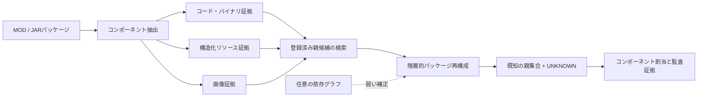

<a id="readme-ja"></a>

# 異種ゲームMODパッケージの複数由来を再構成するサーバーサイド手法

[](README.md#user-content-readme-en) [](README.ko.md#user-content-readme-ko) [](#user-content-readme-ja)

本研究では、複数の既存MODに由来するコード、リソース、画像が混在する再構成MOD/JARパッケージを対象に、各コンポーネントの由来とパッケージ全体の親プロジェクト集合を推定する。ファイル名やプロジェクト識別子には依存せず、内容に基づく証拠を用いる。登録済みの候補から十分な根拠が得られないコンポーネントは `UNKNOWN` とする。本リポジトリには、Phase 1-13の実装、凍結済み評価記録、主要結果、再現用資料を収録している。

> [!IMPORTANT]
> 本システムの出力は技術的な由来分析のための証拠であり、著作権の帰属、侵害の有無、利用許諾、法的責任を判断するものではない。専門家による検討を支援する目的で用いる。

## 研究課題

複数の登録済みプロジェクトと未観測の由来から得られたデータが混在するソフトウェアパッケージについて、コンポーネント単位の由来とパッケージ単位の親プロジェクト集合を再構成できるか。

再配布の過程では、パス名、パッケージのメタデータ、プロジェクト識別子が削除または変更される場合がある。そこで本研究では、内容に基づく証拠を用い、根拠が不十分な帰属を `UNKNOWN` として保持し、コンポーネント単位とパッケージ単位の結果を併せて示す。

## システム概要



主要な信号は内容に基づく証拠である。依存関係グラフは任意の構造的補正としてのみ用いた。TESTの主要な親集合指標に対する効果は小さく、統計的に有意とは判断できなかった。

## 手法の概要

1. 公開プロジェクトとリリースの一覧を構築し、ダウンロードした原本データはGitの管理対象外に置く。
2. コード・バイナリ、構造化リソース、画像から、識別子に依存しない証拠を抽出する。
3. 各クエリパッケージについて、所定数の登録済み親候補を検索する。
4. パッケージ単位の親集合を選択し、各コンポーネントを選択済みの親または `UNKNOWN` に割り当てる。
5. 最終TEST評価の前に、ベンチマーク、パラメータ、マニフェスト、ハッシュを凍結する。
6. 凍結済み手法を再調整せず、不確実性、アブレーション、外部クローン検出、サーバー性能、頑健性、検索のスケーラビリティ、誤りの発生段階を評価する。

## 研究上の貢献

- コード・バイナリ、構造化リソース、画像を対象とするコンポーネント単位の由来分析
- 複数の登録済み親とオープンセットの `UNKNOWN` 処理を統合した階層的再構成手法
- 公開用資料と評価専用資料を分離し、ハッシュ検証と情報漏えい監査を適用した120プロジェクトの凍結ベンチマーク
- 統計的検証、サーバー評価、外部比較、頑健性分析、検索のスケーラビリティ、凍結後の誤り局在化

## 研究の進捗

Phase 1-13のスクリプトと報告対象の結果は、すべて `main` に保存されている。以下の「完了」は当該Phaseの記録が保存済みであることを示す。凍結済みの確認評価用ベンチマークはPhase 6から始まる。

| Phase | 対象 | 状況 |
|---:|---|:---:|
| 1 | 予備収集と実在MOD 30件のデータセット | 完了 |
| 2 | ソース／リリースレジストリと重複監査 | 完了 |
| 3 | バージョン差分とバイトコード・内容ベースライン | 完了 |
| 4 | 依存・リソース参照グラフ | 完了 |
| 5 | 探索的な複数親の階層再構成 | 完了 |
| 6 | 新規120プロジェクト、凍結分割、540クエリ、データ構成 | **凍結** |
| 7 | 較正、手法の凍結、最終TEST評価 | **凍結** |
| 8 | ブートストラップ統計、アブレーション、由来クラスタ感度 | 完了 |
| 9 | サーバー正確性、並行処理、エンドツーエンド、候補群拡張 | 完了 |
| 10 | NiCadCross外部比較とStoneDetector互換性 | 完了 |
| 11 | 制御された複数未知由来への頑健性 | 完了 |
| 12 | 厳密検索とバイナリLSH検索の性能・拡張性比較 | 完了 |
| 13 | 凍結後の自動失敗分析 | 完了 |

[実験インデックス](reproducibility/EXPERIMENT_INDEX.md#user-content-experiment-ja)には、各Phaseのスクリプト、入力、出力、主要結果、凍結状況をまとめている。

## 主要結果

### 凍結済みPhase 7 TEST

最終評価は360クエリ、2,520コンポーネントで構成される。グラフ補正を含む結果を凍結済みの最終手法とし、内容ベースの結果を主要信号の性能およびアブレーションの基準として併記する。

| 手法 | コンポーネント正解率 | `UNKNOWN` F1 | 親集合F1 | 親集合完全一致 | K正解率 |
|---|---:|---:|---:|---:|---:|
| 凍結済み最終手法（グラフ補正） | 0.805952 | 0.753786 | 0.844233 | 0.419444 | 0.486111 |
| 内容ベース手法 | 0.807143 | 0.752386 | 0.843545 | 0.413889 | 0.480556 |

候補検索における既知親の平均再現率は0.974444であった。既知親を含むクエリのうち0.943333では、すべての正解親が候補に含まれた。階層的な内容ベース再構成は、コンポーネントを独立に判定するベースラインより親集合F1が0.046133高かった。グラフ補正と内容ベース手法の親集合F1差は+0.000688であり、クエリ単位ブートストラップによる95%信頼区間は0を含んだ。

### システムおよび外部検証

| 評価 | 対象 | 主要結果 |
|---|---|---|
| サーバー正確性 | 360クエリ / 2,520コンポーネント | 全予測が凍結済み参照結果と一致 |
| 事前計算スコアサーバー | 測定範囲内の最高並行処理性能 | 86.21 requests/s |
| 証拠 → 検索 → 再構成 | 並行度1 | サーバーp50 12.579 ms、検索11.493 ms、再構成1.088 ms |
| ローカルパッケージ → 結果 | 並行度1 | サーバーp50 26.880 ms、抽出14.440 ms、検索10.685 ms |
| 候補群の拡張 | 実在プロジェクト20 → 100件 | 逐次検索p50 4.353 → 21.457 ms |
| NiCadCross対応部分集合 | ソースコードを対応付けられた1,169コンポーネント | 提案手法0.841、NiCadCross 0.710、差+0.131、対応あり95% CI 0.096-0.167 |

Phase 11では、1,260コンポーネントからなる制御再構成180クエリを評価した。コンポーネント正解率は0.841、`UNKNOWN` F1は0.888、単一の `UNKNOWN` にまとめた親集合F1は0.884であった。この評価は未登録コンポーネントの判別性能を測るものであり、異なる未登録由来の同定や個数の復元を対象としない。

Phase 12では、BALANCEDとHIGH_RECALLのバイナリLSHが、凍結TESTの全360クエリで厳密検索と同一の最終予測を維持した。FASTはクエリ予測1件と2,520コンポーネント中1件の予測を変更し、60プロジェクトの実行時間標本におけるp50を10.315 msから8.848 msへ短縮した（1.166倍）。`200eq`/`500eq`/`1000eq`は、100件の実在する登録済み親を基にコンポーネント数のみを増やした合成負荷条件であり、固有の実在MODプロジェクト数ではない。

Phase 13では、凍結TESTで生じた489件のコンポーネント誤りを、コンポーネント帰属325件（66.46%）、`UNKNOWN` 判定81件（16.56%）、親選択47件（9.61%）、検索36件（7.36%）に分類した。このPhaseは診断のみを行い、予測の再計算や手法の変更は行っていない。

## リポジトリ構成

```text
scripts/             Phase 1-13の収集・較正・評価・監査プログラム
server/              Phase 9 FastAPI研究サーバー
tools/               補助ソースコードと外部ツール設定
results/             選別済み要約、監査、予測、凍結マニフェスト
reproducibility/     環境記録、ハッシュ、凍結マニフェスト、実験索引
paper/               論文用の図表生成・結果整理資料
archive/             監査のために保存した生成物、旧版、既知の不具合を含むファイル
data/                一覧と再配布可能なメタデータ。原本データはGitの対象外
```

生のMOD/JAR、外部ツール用に復元したデータ、公開承認前の評価用対応表、キャッシュ、生成済みサーバーデータ、コンパイル結果、仮想環境はGitに含めない。[追跡監査](reproducibility/TRACKING_AUDIT.md#user-content-tracking-ja)に保存方針と過去ファイルの分類根拠を記録している。

## 再現手順と凍結記録

- [再現ガイド](REPRODUCE.md#user-content-reproduce-ja)
- [実験インデックス](reproducibility/EXPERIMENT_INDEX.md#user-content-experiment-ja)
- [環境記録](reproducibility/ENVIRONMENT.md#user-content-environment-ja)
- [追跡監査](reproducibility/TRACKING_AUDIT.md#user-content-tracking-ja)
- [コントリビューションガイド](CONTRIBUTING.md#user-content-contributing-ja)
- [保存資料の説明](archive/README.md#user-content-archive-ja)
- [Phase 12凍結マニフェスト](reproducibility/phase12_freeze_manifest.sha256)
- [Phase 13凍結マニフェスト](reproducibility/phase13_freeze_manifest.sha256)

Phase 6-7の主要記録には、凍結済みデータ分割、クエリ一覧と正解ラベル、原本データのハッシュ一覧、グラフ実験資料、`results/phase7g_final_method_parameters.json` が含まれる。凍結パラメータのSHA-256は `caad17257304d0ab198e01ef327f5acf918e6b8aab3f00e5272be3d20d3f8325` である。

## 解釈上の制約

- 由来スコアだけで法的な所有権、複製、ライセンス遵守、侵害の有無を判断することはできない。
- グラフ補正を主要TEST指標に対する統計的に確立した改善とは解釈できない。
- Phase 9の処理時間は互いに異なる範囲を測定しており、直接置き換えて比較できない。
- NiCadCrossには復元済みJavaソースを入力する一方、提案システムは凍結済みのバイナリ側証拠を用いる。比較は、同じくソースコードを対応付けられた部分集合に限られる。
- StoneDetectorの資料は互換性確認の準備記録であり、比較有効性評価の完了を示さない。
- Phase 7 TESTと凍結後のPhase 11-13分析は、凍結済み手法の再調整に用いていない。

## データ、引用、ライセンス、連絡先

評価用対応表と再配布に注意を要する研究資料の公開範囲を確認しているため、リポジトリは非公開としている。「評価専用」は評価過程でモデルに開示しない正解ラベルを指し、認証情報を意味しない。ただし、これらのファイルは引き続き制限して取り扱う必要がある。

論文は準備中である。正式な書誌情報が確定するまでは、再現に使用した正確なコミットと本リポジトリを併記して引用する。リポジトリ全体に適用するライセンスは現時点で宣言していない。第三者のソースコード、データセット、MOD/JAR、その他の資料には、それぞれの元のライセンスが適用される。

研究および再現に関する報告はGitHub Issuesで受け付ける。非公開の問い合わせは[リポジトリ所有者のGitHubプロフィール](https://github.com/YSL-RyuDo)を通じて連絡できる。
