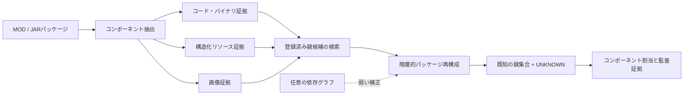

# MOD来歴再構成研究

[](reproducibility/EXPERIMENT_INDEX.md#user-content-experiment-ja)
[](reproducibility/EXPERIMENT_INDEX.md#user-content-freeze-anchors-ja)
[](REPRODUCE.md)

## 言語

[](README.md) [](README.ko.md) [](README.ja.md)

再構成されたMOD/JARパッケージ内の各コンポーネントについて、もっともらしい由来を復元する学術研究リポジトリです。本システムは、コード／バイナリ、構造化リソース、画像からプロジェクト識別子に依存しない証拠を統合し、登録済み候補プロジェクトを検索したうえで、パッケージ単位の親集合を再構成します。登録済みの由来では裏付けられないコンポーネントには、公開ラベル `UNKNOWN` を割り当てます。

> [!IMPORTANT]
> 本システムは、技術的な来歴と証拠を再構成するためのものです。著作権の帰属、侵害、許諾、または法的責任を**判断するものではありません**。出力は、専門家および人による検討を支援するためのものです。

## 研究課題

複数の登録済みプロジェクト由来の素材と、未知の由来の素材を同時に含み得る再構成ソフトウェアパッケージから、コンポーネント単位の由来を復元できるか。

再配布の過程では、パス名、パッケージメタデータ、プロジェクト識別子を容易に削除・変更できます。そのため実用的な来歴推定には、内容に基づく証拠を利用し、不確実性を保持し、コンポーネント単位とパッケージ全体の両方で結果を説明できることが必要です。

## システム概要



内容証拠が主要な信号です。依存グラフは任意の弱い補正としてのみ使用され、主要な親集合指標に対するTESTでの効果は小さく、統計的に決定的ではありませんでした。

## 手法の概要

1. 公開プロジェクトおよびリリースのレジストリを構築し、ダウンロードした生のpayloadはローカルに保持します。
2. コード／バイナリ、構造化リソース、画像の各コンポーネントから、識別子に依存しない証拠を抽出します。
3. 各クエリパッケージに対して、固定数の登録済み親候補を検索します。
4. パッケージ単位の親集合を共同選択し、各コンポーネントを選択された親または `UNKNOWN` に割り当てます。
5. 最終TESTを開く前に、ベンチマーク、パラメータ、manifest、ハッシュを凍結します。
6. 凍結手法を再調整せず、不確実性、baseline、外部clone detector、配備性能、頑健性、検索のスケーラビリティ、失敗箇所を評価します。

## 研究上の貢献

- 登録済み親への帰属とopen-set `UNKNOWN` 棄却を統合した、異種コンポーネント来歴問題の定式化
- コンポーネント割当を整合的なパッケージ単位の親集合に結び付ける階層的再構成手法
- 公開／非公開manifestの分離、ハッシュ検証、漏洩監査を備えた120プロジェクトの凍結ベンチマーク
- クエリ単位bootstrap、ablation、由来cluster感度、サーバー正確性、host依存性能の分析
- 厳密にsource-resolvableなコード部分集合でのNiCadCross比較と、StoneDetector互換性の準備
- 凍結後の複数未知由来に対する頑健性、近似検索のスケーラビリティ、階層的失敗箇所の分析

## 研究の進捗

Phase 1-13の全スクリプトと報告可能な結果が `main` に保存されています。「完了」は各Phaseの記録物が存在することを意味し、凍結された確認的ベンチマークはPhase 6から始まります。

| Phase | 対象 | 状況 |
|---:|---|:---:|
| 1 | 予備収集と30件の実MOD corpus | 完了 |
| 2 | ソース／リリースレジストリと重複監査 | 完了 |
| 3 | バージョン変動とbytecode/content baseline | 完了 |
| 4 | 依存・リソース参照グラフ | 完了 |
| 5 | 探索的な複数親の階層再構成 | 完了 |
| 6 | 新規120プロジェクトcorpus、凍結split、540クエリ、materialization | **凍結** |
| 7 | calibration、手法凍結、最終TEST評価 | **凍結** |
| 8 | bootstrap統計、ablation、由来cluster感度 | 完了 |
| 9 | サーバー正確性、並行性、end-to-end、galleryスケーリング | 完了 |
| 10 | NiCadCross外部比較とStoneDetector互換性 | 完了 |
| 11 | 制御された複数未知由来への頑健性 | 完了 |
| 12 | Exact対binary-LSH検索とスケーラビリティ | 完了 |
| 13 | 凍結後の自動失敗分析 | 完了 |

Phaseごとのscript → input → output → 主要結果 → 凍結状況は、[実験インデックス](reproducibility/EXPERIMENT_INDEX.md#user-content-experiment-ja)に整理しています。

## 主要結果

### 凍結済みPhase 7 TEST

最終評価は360クエリ、2,520コンポーネントで構成されます。グラフ補正を含む結果が凍結済みの最終手法であり、content-onlyの結果は主要信号およびablationの基準として併記しています。

| Track | コンポーネント正解率 | `UNKNOWN` F1 | 親集合F1 | 親集合完全一致 | K正解率 |
|---|---:|---:|---:|---:|---:|
| 凍結最終・グラフ補正 | 0.805952 | 0.753786 | 0.844233 | 0.419444 | 0.486111 |
| Content-only | 0.807143 | 0.752386 | 0.843545 | 0.413889 | 0.480556 |

候補検索では既知親の平均recallが0.974444となり、既知親を含むクエリの0.943333で全ての正解親が候補に含まれました。階層的content手法は、独立コンポーネント判定に比べて親集合F1を0.046133向上させました。グラフ補正とcontent-onlyの親集合F1差は+0.000688で、95%クエリbootstrap信頼区間は0を含みました。

### システムおよび外部検証

| 評価 | 対象 | 主要結果 |
|---|---|---|
| サーバー正確性 | 360クエリ / 2,520コンポーネント | 全クエリ・コンポーネントで凍結参照予測と一致しました。 |
| 事前計算スコアサーバー | 測定上の最良並行度 | 86.21 requests/s |
| 証拠 → 検索 → 再構成 | 並行度1 | サーバーp50 12.579 ms、検索11.493 ms、再構成1.088 ms |
| ローカルパッケージ → 結果 | 並行度1 | サーバーp50 26.880 ms、抽出14.440 ms、検索10.685 ms |
| Galleryスケーリング | 実プロジェクト20 → 100件 | 逐次検索p50 4.353 → 21.457 ms |
| NiCadCross対応部分集合 | source-resolvableなコード1,169件 | 提案手法0.841、NiCadCross 0.710、差+0.131、paired 95% CI 0.096-0.167 |

Phase 11では、制御された再構成による180クエリ／1,260コンポーネントの分析を追加しました。コンポーネント正解率0.841、`UNKNOWN` F1 0.888、collapsed親集合F1 0.884です。凍結モデルは公開 `UNKNOWN` ラベルを1つだけ出力するため、これらは未登録コンポーネントの棄却性能を示すものであり、異なる未知由来の同定や個数の復元性能ではありません。

Phase 12では、BALANCEDおよびHIGH_RECALLのbinary-LSHが、凍結TESTの全360クエリでExactと同じ最終予測を維持しました。FASTは360クエリ中1件、2,520コンポーネント中1件の予測を変更し、60プロジェクトruntime sampleのp50を10.315 msから8.848 msへ短縮しました（1.166倍）。`200eq`/`500eq`/`1000eq`は、100件の実登録親を使った合成コンポーネント量の負荷試験であり、追加の固有実MODプロジェクト数ではありません。

Phase 13では、凍結TESTの489件のエラーを、コンポーネント割当325件（66.46%）、`UNKNOWN` 棄却81件（16.56%）、親選択47件（9.61%）、検索36件（7.36%）に局在化しました。このPhaseは診断専用であり、予測の再計算や手法変更は行いません。

## リポジトリ構成

```text
scripts/             Phase 1-13の収集、calibration、評価、監査スクリプト
server/              Phase 9 FastAPI研究サーバー
tools/               追跡対象の補助ソースとツール設定
results/             選別されたsummary、audit、prediction、凍結manifest
reproducibility/     環境記録、ハッシュ、凍結manifest、実験インデックス
paper/               論文用の図表・報告スクリプト
archive/             監査用に保存した生成物、旧版、既知bug版
data/                レジストリと再配布可能なメタデータ。生payload byteは除外
```

生のMOD/JAR payload、外部ツール用に再構成したcorpus、公開承認を受けていない非公開held-out mapping、cache、生成されたサーバーデータ、compiledファイル、仮想環境は意図的にGitから除外しています。保存方針と過去ファイルの分類は[追跡監査](reproducibility/TRACKING_AUDIT.md)を参照してください。

## 再現と凍結アンカー

- [再現ガイド](REPRODUCE.md)
- [実験インデックス](reproducibility/EXPERIMENT_INDEX.md#user-content-experiment-ja)
- [環境記録](reproducibility/ENVIRONMENT.md)
- [追跡監査](reproducibility/TRACKING_AUDIT.md)
- [Phase 12凍結manifest](reproducibility/phase12_freeze_manifest.sha256)
- [Phase 13凍結manifest](reproducibility/phase13_freeze_manifest.sha256)

Phase 6-7の主要アンカーには、凍結split、クエリmanifestとground truth、payloadハッシュmanifest、グラフtrack、`results/phase7g_final_method_parameters.json` が含まれます。凍結パラメータのSHA-256は `caad17257304d0ab198e01ef327f5acf918e6b8aab3f00e5272be3d20d3f8325` です。

## 責任ある解釈

- 来歴スコアだけから、法的所有権、複製、ライセンス遵守、侵害を推定しないでください。
- グラフ補正が主要TEST指標を統計的に確立された形で改善したと主張しないでください。
- Phase 9の異なるlatency範囲を同一pipelineの測定値として比較しないでください。
- NiCadCrossには再構成したJava sourceを与えますが、提案システムは凍結binary-side証拠を用います。比較は同一のsource-resolvable部分集合に限定されます。
- StoneDetector成果物は互換性準備の記録であり、比較有効性評価の完了を意味しません。
- Phase 7 TEST、Phase 11再構成、Phase 12 operating point、Phase 13診断を凍結手法の再調整に使用しないでください。

## データ、引用、ライセンス、連絡先

Held-out mappingと再配布に配慮が必要な研究資料を確認している間、リポジトリは非公開に保ちます。ベンチマークの「private」ファイルはモデルから隠された評価ラベルを意味し、credentialではありません。それでも機微な研究データとして取り扱う必要があります。

論文は準備中です。正式な書誌情報が確定するまでは、再現に使用した正確なcommit hashと本リポジトリを併記して引用してください。現時点ではリポジトリ全体のライセンスは宣言されていません。ソースコード、データセット、MOD/JAR payload、第三者資料の再配布が許可されていると推定しないでください。第三者の元のライセンスが優先されます。

研究上の質問や再現性の報告には、リポジトリのGitHub Issuesを利用してください。非公開の連絡には、[リポジトリ所有者のGitHubプロフィール](https://github.com/YSL-RyuDo)を利用できます。
