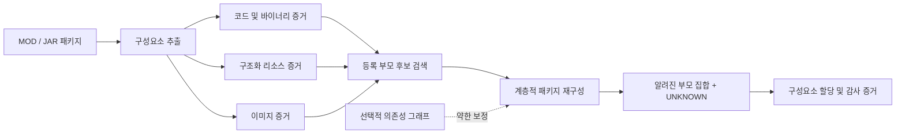

# MOD 출처 재구성 연구

[](reproducibility/EXPERIMENT_INDEX.md#user-content-experiment-ko)
[](reproducibility/EXPERIMENT_INDEX.md#user-content-freeze-anchors-ko)
[](REPRODUCE.md)

## 언어

[](README.md) [](README.ko.md) [](README.ja.md)

재조합된 MOD/JAR 패키지 내부 구성요소의 가능한 출처를 재구성하는 학술 연구 저장소입니다. 시스템은 코드/바이너리, 구조화 리소스, 이미지에서 프로젝트 식별자에 의존하지 않는 증거를 결합하고, 등록된 후보 프로젝트를 검색한 뒤, 패키지 수준의 부모 집합을 재구성합니다. 등록된 출처로 뒷받침되지 않는 구성요소에는 공개 레이블인 `UNKNOWN`을 부여합니다.

> [!IMPORTANT]
> 이 시스템은 기술적 출처와 증거를 재구성하기 위한 도구입니다. 저작권 소유권, 침해 여부, 허락의 존재 또는 법적 책임을 **판단하지 않습니다**. 출력은 전문가와 사람의 검토를 보조하기 위한 것입니다.

## 연구 질문

여러 등록 프로젝트의 자료와 이전에 관찰하지 못한 출처의 자료가 함께 들어 있을 수 있는 재조합 소프트웨어 패키지에서, 각 구성요소의 출처를 재구성할 수 있는가?

재배포 과정에서는 경로명, 패키지 메타데이터, 프로젝트 식별자를 쉽게 제거하거나 바꿀 수 있습니다. 따라서 실용적인 출처 추적 방법은 내용 증거를 사용하고, 불확실성을 보존하며, 구성요소 수준과 전체 패키지 수준의 결과를 함께 설명할 수 있어야 합니다.

## 시스템 개요



내용 증거가 주된 신호입니다. 의존성 그래프는 선택적인 약한 보정으로만 사용되며, 1차 부모 집합 지표에 대한 TEST 효과는 작고 통계적으로 확정적이지 않았습니다.

## 연구 방법 요약

1. 공개 프로젝트 및 릴리스 레지스트리를 구축하고, 다운로드한 원본 payload는 로컬에만 보관합니다.
2. 코드/바이너리, 구조화 리소스, 이미지 구성요소에서 식별자 중립적인 증거를 추출합니다.
3. 각 질의 패키지에 대해 고정된 수의 등록 부모 후보를 검색합니다.
4. 패키지 수준 부모 집합을 공동으로 선택하고 각 구성요소를 선택된 부모 또는 `UNKNOWN`에 할당합니다.
5. 최종 TEST를 열기 전에 벤치마크, 매개변수, manifest, 해시를 동결합니다.
6. 동결된 방법을 재조정하지 않고 불확실성, baseline, 외부 clone detector, 배포 성능, 강건성, 검색 확장성, 실패 위치를 평가합니다.

## 연구 기여

- 등록 부모 귀속과 open-set `UNKNOWN` 거부를 결합한 이질적 구성요소 출처 문제 정의
- 구성요소 할당을 일관된 패키지 수준 부모 집합과 연결하는 계층적 재구성 방법
- 공개/비공개 manifest 분리, 해시 검증, 누수 감사를 갖춘 120개 프로젝트 동결 벤치마크
- 질의 단위 bootstrap, ablation, 출처-cluster 민감도, 서버 정확성 및 host 종속 성능 분석
- 엄격히 source-resolvable한 코드 부분집합에서의 NiCadCross 비교와 StoneDetector 호환성 준비
- 동결 이후의 다중 미등록 출처 강건성, 근사 검색 확장성, 계층적 실패 위치 분석

## 연구 진행 현황

Phase 1-13의 모든 스크립트와 보고 가능한 결과가 `main`에 보존되어 있습니다. “완료”는 해당 단계의 기록물이 존재한다는 뜻이며, 동결된 확인적 벤치마크는 Phase 6부터 시작합니다.

| Phase | 범위 | 상태 |
|---:|---|:---:|
| 1 | 예비 수집 및 30개 실제 MOD corpus | 완료 |
| 2 | 소스/릴리스 레지스트리와 중복 감사 | 완료 |
| 3 | 버전 변화 및 bytecode/content baseline | 완료 |
| 4 | 의존성과 리소스 참조 그래프 | 완료 |
| 5 | 탐색적 다중 부모 계층 재구성 | 완료 |
| 6 | 신규 120개 프로젝트 corpus, 동결 split, 540개 질의 및 materialization | **동결** |
| 7 | calibration, 방법 동결 및 최종 TEST 평가 | **동결** |
| 8 | bootstrap 통계, ablation, 출처-cluster 민감도 | 완료 |
| 9 | 서버 정확성, 동시성, end-to-end 및 gallery 확장성 | 완료 |
| 10 | NiCadCross 외부 비교 및 StoneDetector 호환성 | 완료 |
| 11 | 통제된 다중 미등록 출처 강건성 | 완료 |
| 12 | Exact 대 binary-LSH 검색 및 확장성 | 완료 |
| 13 | 동결 후 자동 실패 분석 | 완료 |

각 Phase의 script → input → output → 핵심 결과 → 동결 여부는 [실험 인덱스](reproducibility/EXPERIMENT_INDEX.md#user-content-experiment-ko)에 정리되어 있습니다.

## 핵심 결과

### 동결된 Phase 7 TEST

최종 평가는 360개 질의와 2,520개 구성요소로 이루어집니다. 그래프 보정 결과가 동결된 최종 방법이며, content-only 결과는 주된 신호와 ablation 기준으로 함께 보존됩니다.

| Track | 구성요소 정확도 | `UNKNOWN` F1 | 부모 집합 F1 | 부모 집합 완전일치 | K 정확도 |
|---|---:|---:|---:|---:|---:|
| 동결 최종, 그래프 보정 | 0.805952 | 0.753786 | 0.844233 | 0.419444 | 0.486111 |
| Content-only | 0.807143 | 0.752386 | 0.843545 | 0.413889 | 0.480556 |

후보 검색의 평균 알려진 부모 recall은 0.974444였고, 알려진 부모가 있는 질의의 0.943333에서 모든 실제 부모가 후보에 포함되었습니다. 계층적 content 방법은 독립 구성요소 판정보다 부모 집합 F1을 0.046133 높였습니다. 그래프 보정과 content-only의 부모 집합 F1 차이는 +0.000688이었으며, 95% 질의 bootstrap 신뢰구간은 0을 포함했습니다.

### 시스템 및 외부 검증

| 평가 | 범위 | 핵심 결과 |
|---|---|---|
| 서버 정확성 | 360개 질의 / 2,520개 구성요소 | 모든 질의와 구성요소에서 동결 기준 예측과 일치했습니다. |
| 사전 계산 점수 서버 | 측정된 최적 동시성 | 86.21 requests/s |
| 증거 → 검색 → 재구성 | 동시성 1 | 서버 p50 12.579 ms, 검색 11.493 ms, 재구성 1.088 ms |
| 로컬 패키지 → 결과 | 동시성 1 | 서버 p50 26.880 ms, 추출 14.440 ms, 검색 10.685 ms |
| Gallery 확장 | 실제 프로젝트 20 → 100개 | 순차 검색 p50 4.353 → 21.457 ms |
| NiCadCross 대응 부분집합 | source-resolvable 코드 구성요소 1,169개 | 제안 방법 0.841 대 NiCadCross 0.710; 차이 +0.131, paired 95% CI 0.096-0.167 |

Phase 11은 통제된 재조합 180개 질의/1,260개 구성요소 분석을 추가했습니다. 구성요소 정확도 0.841, `UNKNOWN` F1 0.888, collapsed 부모 집합 F1 0.884입니다. 동결 모델은 공개 `UNKNOWN` 레이블을 하나만 출력하므로, 이 수치는 미등록 구성요소의 거부 성능을 측정할 뿐 서로 다른 미등록 출처의 정체나 개수를 복원하는 성능을 뜻하지 않습니다.

Phase 12에서는 BALANCED와 HIGH_RECALL binary-LSH가 동결 TEST 360개 전체에서 Exact와 같은 최종 예측을 유지했습니다. FAST는 360개 중 질의 예측 1개와 2,520개 중 구성요소 예측 1개를 바꾸면서, 60개 프로젝트 runtime sample의 p50을 10.315 ms에서 8.848 ms로 줄였습니다(1.166배). `200eq`/`500eq`/`1000eq`는 실제 등록 부모 100개를 사용한 합성 구성요소 부하 실험이며, 고유한 실제 MOD 프로젝트 수가 아닙니다.

Phase 13은 동결 TEST의 오류 489개를 구성요소 할당 325개(66.46%), `UNKNOWN` 거부 81개(16.56%), 부모 선택 47개(9.61%), 검색 36개(7.36%)로 위치화했습니다. 이 단계는 진단 전용이며 예측을 다시 계산하거나 방법을 바꾸지 않습니다.

## 저장소 구성

```text
scripts/             Phase 1-13 수집, calibration, 평가 및 감사 스크립트
server/              Phase 9 FastAPI 연구 서버
tools/               추적되는 보조 소스와 도구 설정
results/             선별된 summary, audit, prediction, 동결 manifest
reproducibility/     환경 기록, 해시, 동결 manifest, 실험 색인
paper/               논문용 그림 및 보고 스크립트
archive/             감사를 위해 보존한 생성물, 대체된 버전, 알려진 bug 버전
data/                레지스트리와 재배포 가능한 메타데이터; 원본 payload byte는 제외
```

원본 MOD/JAR payload, 외부 도구용 복원 corpus, 공개 승인을 받지 않은 비공개 held-out mapping, cache, 생성 서버 데이터, compiled 파일, 가상환경은 의도적으로 Git에서 제외합니다. 보존 정책과 과거 파일 분류는 [추적 감사](reproducibility/TRACKING_AUDIT.md)를 참고하세요.

## 재현 및 동결 기준점

- [재현 안내](REPRODUCE.md)
- [실험 인덱스](reproducibility/EXPERIMENT_INDEX.md#user-content-experiment-ko)
- [환경 기록](reproducibility/ENVIRONMENT.md)
- [추적 감사](reproducibility/TRACKING_AUDIT.md)
- [Phase 12 동결 manifest](reproducibility/phase12_freeze_manifest.sha256)
- [Phase 13 동결 manifest](reproducibility/phase13_freeze_manifest.sha256)

Phase 6-7의 핵심 기준점은 동결 split, 질의 manifest와 ground truth, payload 해시 manifest, 그래프 track, `results/phase7g_final_method_parameters.json`입니다. 동결 매개변수 SHA-256은 `caad17257304d0ab198e01ef327f5acf918e6b8aab3f00e5272be3d20d3f8325`입니다.

## 책임 있는 해석

- 출처 점수만으로 법적 소유권, 복제, 라이선스 준수 또는 침해 여부를 추론하지 마세요.
- 그래프 보정이 1차 TEST 지표를 통계적으로 확립된 수준으로 개선했다고 주장하지 마세요.
- Phase 9의 서로 다른 latency 범위를 같은 pipeline 측정치처럼 비교하지 마세요.
- NiCadCross에는 복원된 Java source가 제공되지만 제안 시스템은 동결 binary-side 증거를 사용합니다. 비교는 동일한 source-resolvable 부분집합으로 제한됩니다.
- StoneDetector 기록은 호환성 준비 결과이며 비교 효과 평가의 완료를 뜻하지 않습니다.
- Phase 7 TEST, Phase 11 재조합, Phase 12 operating point, Phase 13 진단을 동결 방법 재조정에 사용하지 마세요.

## 데이터, 인용, 라이선스 및 문의

Held-out mapping과 재배포에 민감한 연구 자료를 검토하는 동안 저장소는 비공개로 유지합니다. 벤치마크에서 “private” 파일은 모델에 공개되지 않는 평가 정답을 뜻하며 credential이 아닙니다. 그래도 민감한 연구 데이터로 취급해야 합니다.

논문은 준비 중입니다. 정식 서지정보가 확정되기 전에는 재현에 사용한 정확한 commit hash와 이 저장소를 함께 인용하세요. 현재 저장소 전체에 적용되는 라이선스는 선언되지 않았습니다. 소스 코드, 데이터셋, MOD/JAR payload 또는 제3자 자료의 재배포 권한이 있다고 추정하지 마세요. 제3자의 원래 라이선스가 우선합니다.

연구 질문과 재현성 보고는 저장소의 GitHub Issues를 이용해 주세요. 비공개 문의는 [저장소 소유자의 GitHub 프로필](https://github.com/YSL-RyuDo)을 이용할 수 있습니다.
