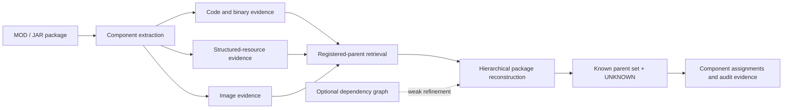
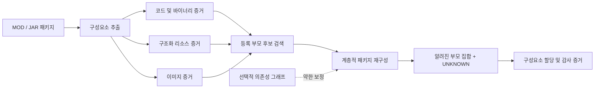
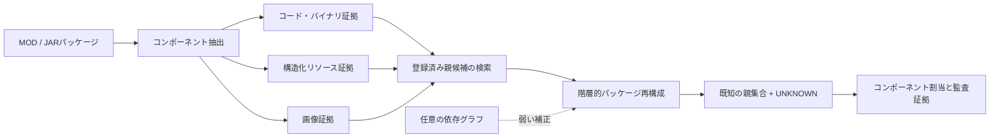

# Server-Side Multi-Parent Provenance Reconstruction for Heterogeneous Game MOD Packages

[](reproducibility/EXPERIMENT_INDEX.md#user-content-experiment-en)
[](reproducibility/EXPERIMENT_INDEX.md#freeze-anchors)
[](REPRODUCE.md#user-content-reproduce-en)

## Languages

[](#user-content-readme-en) [](#user-content-readme-ko) [](#user-content-readme-ja)

<a id="readme-en"></a>

This repository implements and evaluates a server-side method for reconstructing the provenance of recomposed MOD/JAR packages. The method attributes code/binary, structured-resource, and image components to one or more registered parent projects and retains `UNKNOWN` when the registered corpus does not support an attribution. Phase 1-13 source code, frozen evaluation records, principal results, and reproduction material are preserved here.

> [!IMPORTANT]
> The output is technical provenance evidence, not a legal determination of copyright ownership, infringement, permission, or liability. It is intended to support expert review.

## Research question

Can the component-level origins of a recomposed software package be reconstructed when the package may contain material from multiple registered projects as well as previously unseen sources?

Redistribution can remove or rewrite path names, package metadata, and project identifiers. The study therefore relies on content evidence, preserves unsupported attribution as `UNKNOWN`, and reports results at both component and package levels.

## System overview



Content evidence is the primary signal. The dependency graph is an optional weak refinement; its TEST effect on the primary parent-set metric was small and statistically inconclusive.

## Method

1. Build public project and release registries, while retaining raw downloadable payloads locally.
2. Extract identity-neutral evidence from code/binary, structured-resource, and image components.
3. Retrieve a fixed candidate pool of registered parent projects for each query package.
4. Jointly select the package-level parent set and assign each component to a selected parent or `UNKNOWN`.
5. Freeze the benchmark, parameters, manifests, and hashes before opening the final TEST split.
6. Evaluate uncertainty, baselines, external clone detection, deployment behavior, robustness, retrieval scalability, and failure localization without retuning the frozen method.

## Contributions

- A heterogeneous component-provenance formulation that combines registered-parent attribution with open-set `UNKNOWN` rejection.
- A hierarchical reconstruction method that links component assignments to a coherent package-level parent set.
- A frozen 120-project benchmark with public/private manifest separation, hash verification, and leakage audits.
- Query-level bootstrap, ablation, source-cluster sensitivity, server correctness, and host-specific performance analyses.
- External NiCadCross comparison on a strictly source-resolvable code subset, plus compatibility preparation for StoneDetector.
- Post-freeze multi-unknown robustness, approximate-retrieval scalability, and hierarchical failure-localization studies.

## Research progress

All Phase 1-13 scripts and reportable outputs are preserved on `main`. “Complete” means the recorded phase artifacts exist; only Phase 6 onward forms the frozen confirmatory benchmark.

| Phase | Scope | Status |
|---:|---|:---:|
| 1 | Pilot collection and 30-project real-MOD corpus | Complete |
| 2 | Source/release registries and duplicate audits | Complete |
| 3 | Version-drift and bytecode/content baselines | Complete |
| 4 | Dependency and resource-reference graphs | Complete |
| 5 | Exploratory multi-parent hierarchical reconstruction | Complete |
| 6 | Fresh 120-project corpus, frozen splits, 540 queries, and materialization | **Frozen** |
| 7 | Calibration, method freeze, and final TEST evaluation | **Frozen** |
| 8 | Bootstrap statistics, ablations, and source-cluster sensitivity | Complete |
| 9 | Server correctness, concurrency, end-to-end, and gallery scaling | Complete |
| 10 | NiCadCross external comparison and StoneDetector compatibility | Complete |
| 11 | Controlled multiple-unknown-source robustness | Complete |
| 12 | Exact versus binary-LSH retrieval and scalability | Complete |
| 13 | Post-freeze automated failure analysis | Complete |

The detailed script → input → output → result → freeze map is in the [Experiment Index](reproducibility/EXPERIMENT_INDEX.md#user-content-experiment-en).

## Key results

### Frozen Phase 7 TEST

The final evaluation contains 360 queries and 2,520 components. The graph-refined result is the frozen final method; content-only is retained as the primary signal and ablation reference.

| Track | Component accuracy | `UNKNOWN` F1 | Parent-set F1 | Parent-set exact | K accuracy |
|---|---:|---:|---:|---:|---:|
| Frozen final, graph-refined | 0.805952 | 0.753786 | 0.844233 | 0.419444 | 0.486111 |
| Content-only | 0.807143 | 0.752386 | 0.843545 | 0.413889 | 0.480556 |

Candidate retrieval reached 0.974444 mean known-parent recall, with every known parent present for 0.943333 of known-parent queries. Hierarchical content improved parent-set F1 by 0.046133 over independent component decisions. The graph-minus-content parent-set F1 delta was +0.000688, and its 95% query-bootstrap confidence interval included zero.

### System and external validation

| Evaluation | Scope | Headline result |
|---|---|---|
| Server correctness | 360 queries / 2,520 components | Predictions matched the frozen reference for every query and component. |
| Precomputed-score server | Best measured concurrency | 86.21 requests/s. |
| Evidence → search → reconstruction | Concurrency 1 | Server p50 12.579 ms; search 11.493 ms; reconstruction 1.088 ms. |
| Local package → result | Concurrency 1 | Server p50 26.880 ms; extraction 14.440 ms; search 10.685 ms. |
| Gallery scaling | 20 → 100 real projects | Sequential search p50 4.353 → 21.457 ms. |
| NiCadCross paired subset | 1,169 source-resolvable code components | Proposed 0.841 vs NiCadCross 0.710 component accuracy; delta +0.131, paired 95% CI 0.096-0.167. |

Phase 11 adds a controlled 180-query / 1,260-component recomposition analysis: component accuracy 0.841, `UNKNOWN` F1 0.888, and collapsed parent-set F1 0.884. Because the frozen model emits one public `UNKNOWN` label, these numbers measure rejection of unregistered components—not recovery of distinct unknown identities or multiplicity.

Phase 12 found that BALANCED and HIGH_RECALL binary-LSH configurations preserved Exact predictions on all 360 frozen TEST queries. FAST changed 1/360 query prediction and 1/2,520 component prediction, while reducing the 60-project runtime-sample p50 from 10.315 ms to 8.848 ms (1.166×). The `200eq`/`500eq`/`1000eq` conditions are synthetic component-volume stresses over 100 real registered parents, not additional unique MOD projects.

Phase 13 localized 489 frozen TEST component errors: component assignment 325 (66.46%), `UNKNOWN` rejection 81 (16.56%), parent selection 47 (9.61%), and retrieval 36 (7.36%). It is diagnostic only and does not recompute predictions or change the method.

## Repository map

```text
scripts/             Phase 1-13 collection, calibration, evaluation, and audit scripts
server/              Phase 9 FastAPI research services
tools/               Tracked helper source and tool configuration
results/             Curated summaries, audits, predictions, and frozen manifests
reproducibility/     Environment records, hashes, freeze manifests, and experiment index
paper/               Paper-oriented figure and reporting scripts
archive/             Historical generated, superseded, and known-bug artifacts retained for audit
data/                Registries and redistributable metadata; raw payload bytes remain ignored
```

Raw MOD/JAR payloads, reconstructed external-tool corpora, private held-out mappings not approved for release, caches, generated server data, compiled files, and virtual environments are intentionally excluded from Git. See [Tracking Audit](reproducibility/TRACKING_AUDIT.md#user-content-tracking-en) for the preservation policy and historical classification.

## Reproduction and freeze anchors

- [Reproduction guide](REPRODUCE.md#user-content-reproduce-en)
- [Experiment index](reproducibility/EXPERIMENT_INDEX.md#user-content-experiment-en)
- [Environment record](reproducibility/ENVIRONMENT.md#user-content-environment-en)
- [Tracking audit](reproducibility/TRACKING_AUDIT.md#user-content-tracking-en)
- [Contribution guide](CONTRIBUTING.md#user-content-contributing-en)
- [Archive notes](archive/README.md#user-content-archive-en)
- [Phase 12 freeze manifest](reproducibility/phase12_freeze_manifest.sha256)
- [Phase 13 freeze manifest](reproducibility/phase13_freeze_manifest.sha256)

Core Phase 6-7 anchors include the frozen split, query manifest and ground truth, payload-hash manifest, graph tracks, and `results/phase7g_final_method_parameters.json`. The frozen parameter SHA-256 is `caad17257304d0ab198e01ef327f5acf918e6b8aab3f00e5272be3d20d3f8325`.

## Interpretation limits

- Do not infer legal ownership, copying, license compliance, or infringement from a provenance score alone.
- Do not claim the graph refinement is a statistically established improvement on the primary TEST metric.
- Do not compare the Phase 9 latency scopes as if they measured the same pipeline.
- NiCadCross receives reconstructed Java source while the proposed system uses frozen binary-side evidence; the comparison is restricted to the same source-resolvable subset.
- StoneDetector artifacts document compatibility preparation, not a completed comparative effectiveness result.
- Do not use Phase 7 TEST, Phase 11 recompositions, Phase 12 operating points, or Phase 13 diagnostics to retune the frozen method.

## Data, citation, license, and contact

The repository is kept private while held-out mappings and redistribution-sensitive research artifacts are reviewed. “Private” benchmark files refer to model-private evaluation labels; they are not credentials and must still be handled as sensitive research data.

The paper is under preparation. Until formal bibliographic metadata is finalized, cite this repository together with the exact commit hash used for reproduction. No repository-wide license has yet been declared; do not assume that source code, datasets, MOD/JAR payloads, or third-party materials are licensed for redistribution. Original third-party licenses remain controlling.

For research questions or reproducibility reports, use the repository's GitHub Issues. For private contact, use the [repository owner's GitHub profile](https://github.com/YSL-RyuDo).

---

<a id="readme-ko"></a>

# 이종 게임 MOD 패키지의 서버 기반 다중 출처 계보 복원

[](#user-content-readme-en) [](#user-content-readme-ko) [](#user-content-readme-ja)

본 연구는 여러 기존 MOD의 코드·리소스·이미지가 섞인 재조합 MOD/JAR 패키지를 대상으로 구성요소별 출처와 패키지 전체의 부모 집합을 함께 추정한다. 파일명이나 프로젝트 식별자에 기대지 않고 내용 기반 증거를 사용하며, 등록된 후보로 설명할 수 없는 구성요소는 `UNKNOWN`으로 남긴다. 이 저장소에는 Phase 1-13의 구현, 동결된 평가 기록, 주요 결과와 재현 자료가 정리되어 있다.

> [!IMPORTANT]
> 본 시스템의 출력은 기술적 출처 분석을 위한 증거이며 저작권의 귀속, 침해 여부, 이용 허락 또는 법적 책임에 대한 판단이 아니다. 결과는 전문가의 검토를 보조하는 용도로 사용한다.

## 연구 질문

여러 등록 프로젝트와 이전에 관찰하지 못한 출처의 자료가 섞인 소프트웨어 패키지에서 구성요소별 출처와 패키지 수준의 부모 집합을 재구성할 수 있는가?

재배포 과정에서는 경로명, 패키지 메타데이터와 프로젝트 식별자가 제거되거나 변경될 수 있다. 이에 따라 본 연구는 내용 기반 증거를 사용하고, 근거가 부족한 귀속은 `UNKNOWN`으로 유지하며, 구성요소와 패키지 두 수준의 결과를 함께 제시한다.

## 시스템 개요



주된 신호는 내용 기반 증거다. 의존성 그래프는 선택적인 구조 보정에만 사용했으며, TEST의 주요 부모 집합 지표에 미친 영향은 작고 통계적으로 유의하다고 볼 수 없었다.

## 연구 방법

1. 공개 프로젝트와 릴리스 목록을 구축하고 내려받은 원본 데이터는 Git 외부에 보관한다.
2. 코드·바이너리, 구조화 리소스와 이미지에서 식별자에 의존하지 않는 증거를 추출한다.
3. 각 질의 패키지에 대해 정해진 수의 등록 부모 후보를 검색한다.
4. 패키지 수준의 부모 집합을 선택하고 각 구성요소를 선택된 부모 또는 `UNKNOWN`에 귀속한다.
5. 최종 TEST 평가 전에 벤치마크, 매개변수, 명세 파일과 해시를 동결한다.
6. 동결된 방법을 다시 조정하지 않고 불확실성, 제거 실험, 외부 복제 탐지기, 서버 성능, 강건성, 검색 확장성과 오류 발생 단계를 평가한다.

## 연구 기여

- 코드·바이너리, 구조화 리소스와 이미지에 걸친 구성요소 수준 출처 분석
- 여러 등록 부모와 개방형 `UNKNOWN` 처리를 결합한 계층적 재구성 방법
- 공개용 자료와 평가 전용 자료를 분리하고 해시 검증과 누수 감사를 적용한 120개 프로젝트 동결 벤치마크
- 통계 검증, 서버 평가, 외부 비교, 강건성 분석, 검색 확장성과 동결 후 오류 위치 분석

## 연구 진행 현황

Phase 1-13의 스크립트와 보고 대상 결과는 모두 `main`에 보존되어 있다. 아래의 “완료”는 해당 단계의 기록이 보존되었다는 뜻이며, 동결된 확인 평가용 벤치마크는 Phase 6부터 시작한다.

| Phase | 범위 | 상태 |
|---:|---|:---:|
| 1 | 예비 수집과 실제 MOD 30개 데이터셋 | 완료 |
| 2 | 소스/릴리스 레지스트리와 중복 감사 | 완료 |
| 3 | 버전 변화 및 바이트코드·내용 기반 기준선 | 완료 |
| 4 | 의존성과 리소스 참조 그래프 | 완료 |
| 5 | 탐색적 다중 부모 계층 재구성 | 완료 |
| 6 | 신규 120개 프로젝트, 동결 분할, 540개 질의와 데이터 구성 | **동결** |
| 7 | 보정, 방법 동결과 최종 TEST 평가 | **동결** |
| 8 | 부트스트랩 통계, 제거 실험과 출처 군집 민감도 | 완료 |
| 9 | 서버 정확성, 동시 처리, 전체 처리 과정과 후보군 확장 | 완료 |
| 10 | NiCadCross 외부 비교 및 StoneDetector 호환성 | 완료 |
| 11 | 통제된 다중 미등록 출처 강건성 | 완료 |
| 12 | 정확 검색과 이진 LSH 검색의 성능·확장성 비교 | 완료 |
| 13 | 동결 후 자동 실패 분석 | 완료 |

[실험 인덱스](reproducibility/EXPERIMENT_INDEX.md#user-content-experiment-ko)에는 각 단계의 스크립트, 입력, 출력, 주요 결과와 동결 여부가 정리되어 있다.

## 핵심 결과

### 동결된 Phase 7 TEST

최종 평가는 360개 질의와 2,520개 구성요소로 이루어진다. 그래프 보정을 포함한 결과가 동결된 최종 방법이며, 내용 기반 결과는 주 신호의 성능과 제거 실험 기준을 함께 보여 준다.

| 방법 | 구성요소 정확도 | `UNKNOWN` F1 | 부모 집합 F1 | 부모 집합 완전 일치 | K 정확도 |
|---|---:|---:|---:|---:|---:|
| 동결 최종 방법(그래프 보정) | 0.805952 | 0.753786 | 0.844233 | 0.419444 | 0.486111 |
| 내용 기반 방법 | 0.807143 | 0.752386 | 0.843545 | 0.413889 | 0.480556 |

후보 검색에서 알려진 부모의 평균 재현율은 0.974444였으며, 알려진 부모가 있는 질의 중 0.943333에서는 모든 실제 등록 부모가 후보에 포함되었다. 계층적 내용 재구성은 구성요소를 독립적으로 판정한 기준선보다 부모 집합 F1이 0.046133 높았다. 그래프 보정과 내용 기반 방법의 부모 집합 F1 차이는 +0.000688이었고, 질의 단위 부트스트랩 95% 신뢰구간은 0을 포함했다.

### 시스템 및 외부 검증

| 평가 | 범위 | 핵심 결과 |
|---|---|---|
| 서버 정확성 | 360개 질의 / 2,520개 구성요소 | 모든 예측이 동결 기준과 일치 |
| 사전 계산 점수 서버 | 측정 범위 내 최고 동시 처리 성능 | 86.21 requests/s |
| 증거 → 검색 → 재구성 | 동시성 1 | 서버 p50 12.579 ms, 검색 11.493 ms, 재구성 1.088 ms |
| 로컬 패키지 → 결과 | 동시성 1 | 서버 p50 26.880 ms, 추출 14.440 ms, 검색 10.685 ms |
| 후보군 확장 | 실제 프로젝트 20 → 100개 | 순차 검색 p50 4.353 → 21.457 ms |
| NiCadCross 대응 부분집합 | 소스 코드를 확인할 수 있는 구성요소 1,169개 | 제안 방법 0.841, NiCadCross 0.710; 차이 +0.131, 대응표본 95% CI 0.096-0.167 |

Phase 11은 1,260개 구성요소로 이루어진 통제 재조합 질의 180개를 평가했다. 구성요소 정확도는 0.841, `UNKNOWN` F1은 0.888, 단일 `UNKNOWN`으로 합산한 부모 집합 F1은 0.884였다. 이 평가는 미등록 구성요소를 가려내는 성능을 측정하며, 서로 다른 미등록 출처의 정체나 개수를 복원하는 실험은 아니다.

Phase 12에서 BALANCED와 HIGH_RECALL 이진 LSH는 동결 TEST 360개 전체에서 정확 검색과 동일한 최종 예측을 유지했다. FAST는 질의 예측 1개와 구성요소 예측 2,520개 중 1개를 바꾸면서 60개 프로젝트 실행 시간 표본의 p50을 10.315 ms에서 8.848 ms로 줄였다(1.166배). `200eq`/`500eq`/`1000eq`는 실제 등록 부모 100개를 바탕으로 구성요소 수만 늘린 합성 부하 조건이며, 고유한 실제 MOD 프로젝트 수가 아니다.

Phase 13은 동결 TEST에서 발생한 구성요소 오류 489개를 구성요소 귀속 325개(66.46%), `UNKNOWN` 판정 81개(16.56%), 부모 선택 47개(9.61%), 검색 36개(7.36%)로 구분했다. 이 단계는 진단만 수행했으며 예측을 다시 계산하거나 방법을 변경하지 않았다.

## 저장소 구성

```text
scripts/             Phase 1-13의 수집·보정·평가·감사 프로그램
server/              Phase 9 FastAPI 연구 서버
tools/               보조 소스 코드와 외부 도구 설정
results/             선별된 요약, 감사, 예측과 동결 명세
reproducibility/     환경 기록, 해시, 동결 명세와 실험 인덱스
paper/               논문용 그림 생성 및 결과 정리 자료
archive/             감사를 위해 보존한 생성물·구버전·오류가 확인된 파일
data/                목록과 재배포 가능한 메타데이터; 원본 데이터는 Git에서 제외
```

원본 MOD/JAR, 외부 도구용으로 복원한 데이터, 공개 승인을 받지 않은 평가용 대응표, 캐시, 생성된 서버 데이터, 컴파일 결과와 가상환경은 Git에 포함하지 않는다. [추적 감사](reproducibility/TRACKING_AUDIT.md#user-content-tracking-ko)에 보존 원칙과 과거 파일의 분류 근거가 기록되어 있다.

## 재현 및 동결 기록

- [재현 안내](REPRODUCE.md#user-content-reproduce-ko)
- [실험 인덱스](reproducibility/EXPERIMENT_INDEX.md#user-content-experiment-ko)
- [환경 기록](reproducibility/ENVIRONMENT.md#user-content-environment-ko)
- [추적 감사](reproducibility/TRACKING_AUDIT.md#user-content-tracking-ko)
- [기여 안내](CONTRIBUTING.md#user-content-contributing-ko)
- [보관 자료 설명](archive/README.md#user-content-archive-ko)
- [Phase 12 동결 명세](reproducibility/phase12_freeze_manifest.sha256)
- [Phase 13 동결 명세](reproducibility/phase13_freeze_manifest.sha256)

Phase 6-7의 주요 기록에는 동결된 데이터 분할, 질의 목록과 정답, 원본 데이터 해시 목록, 그래프 실험 자료와 `results/phase7g_final_method_parameters.json`이 포함된다. 동결 매개변수의 SHA-256은 `caad17257304d0ab198e01ef327f5acf918e6b8aab3f00e5272be3d20d3f8325`이다.

## 해석 범위

- 출처 점수만으로 법적 소유권, 복제, 라이선스 준수 또는 침해 여부를 판단할 수 없다.
- 그래프 보정은 주요 TEST 지표에서 통계적으로 확립된 개선으로 해석할 수 없다.
- Phase 9의 지연 시간 결과는 서로 다른 처리 범위를 측정하므로 직접 맞바꿔 비교할 수 없다.
- NiCadCross에는 복원된 Java 소스가 입력되지만 제안 시스템은 동결된 바이너리 측 증거를 사용한다. 비교 범위는 동일하게 소스 코드를 확인할 수 있는 부분집합으로 제한된다.
- StoneDetector 자료는 호환성 준비 기록이며 비교 효과 평가의 완료를 뜻하지 않는다.
- Phase 7 TEST와 동결 후 Phase 11-13 분석은 동결 방법의 재조정에 사용하지 않았다.

## 데이터, 인용, 라이선스와 문의

평가용 대응표와 재배포에 주의가 필요한 연구 자료의 공개 범위를 검토하는 동안 저장소는 비공개로 유지한다. “평가 전용”은 평가 과정에서 모델에 공개하지 않은 정답을 뜻하며 인증정보라는 뜻은 아니다. 다만 해당 파일은 계속 제한적으로 관리해야 한다.

논문은 준비 중이다. 정식 서지정보가 확정되기 전에는 재현에 사용한 정확한 커밋과 이 저장소를 함께 인용한다. 저장소 전체에 적용되는 라이선스는 아직 선언하지 않았으며, 제3자 소스 코드·데이터셋·MOD/JAR와 기타 자료에는 각각의 원래 라이선스가 적용된다.

연구 및 재현 관련 보고는 GitHub Issues에서 접수한다. 비공개 문의는 [저장소 소유자의 GitHub 프로필](https://github.com/YSL-RyuDo)을 통해 전달할 수 있다.

---

<a id="readme-ja"></a>

# 異種ゲームMODパッケージの複数由来を再構成するサーバーサイド手法

[](#user-content-readme-en) [](#user-content-readme-ko) [](#user-content-readme-ja)

本研究では、複数の既存MODに由来するコード、リソース、画像が混在する再構成MOD/JARパッケージを対象に、各コンポーネントの由来とパッケージ全体の親プロジェクト集合を推定する。ファイル名やプロジェクト識別子には依存せず、内容に基づく証拠を用いる。登録済みの候補から十分な根拠が得られないコンポーネントは `UNKNOWN` とする。本リポジトリには、Phase 1-13の実装、凍結済み評価記録、主要結果、再現用資料を収録している。

> [!IMPORTANT]
> 本システムの出力は技術的な由来分析のための証拠であり、著作権の帰属、侵害の有無、利用許諾、法的責任を判断するものではない。専門家による検討を支援する目的で用いる。

## 研究課題

複数の登録済みプロジェクトと未観測の由来から得られたデータが混在するソフトウェアパッケージについて、コンポーネント単位の由来とパッケージ単位の親プロジェクト集合を再構成できるか。

再配布の過程では、パス名、パッケージのメタデータ、プロジェクト識別子が削除または変更される場合がある。そこで本研究では、内容に基づく証拠を用い、根拠が不十分な帰属を `UNKNOWN` として保持し、コンポーネント単位とパッケージ単位の結果を併せて示す。

## システム概要



主要な信号は内容に基づく証拠である。依存関係グラフは任意の構造的補正としてのみ用いた。TESTの主要な親集合指標に対する効果は小さく、統計的に有意とは判断できなかった。

## 手法の概要

1. 公開プロジェクトとリリースの一覧を構築し、ダウンロードした原本データはGitの管理対象外に置く。
2. コード・バイナリ、構造化リソース、画像から、識別子に依存しない証拠を抽出する。
3. 各クエリパッケージについて、所定数の登録済み親候補を検索する。
4. パッケージ単位の親集合を選択し、各コンポーネントを選択済みの親または `UNKNOWN` に割り当てる。
5. 最終TEST評価の前に、ベンチマーク、パラメータ、マニフェスト、ハッシュを凍結する。
6. 凍結済み手法を再調整せず、不確実性、アブレーション、外部クローン検出、サーバー性能、頑健性、検索のスケーラビリティ、誤りの発生段階を評価する。

## 研究上の貢献

- コード・バイナリ、構造化リソース、画像を対象とするコンポーネント単位の由来分析
- 複数の登録済み親とオープンセットの `UNKNOWN` 処理を統合した階層的再構成手法
- 公開用資料と評価専用資料を分離し、ハッシュ検証と情報漏えい監査を適用した120プロジェクトの凍結ベンチマーク
- 統計的検証、サーバー評価、外部比較、頑健性分析、検索のスケーラビリティ、凍結後の誤り局在化

## 研究の進捗

Phase 1-13のスクリプトと報告対象の結果は、すべて `main` に保存されている。以下の「完了」は当該Phaseの記録が保存済みであることを示す。凍結済みの確認評価用ベンチマークはPhase 6から始まる。

| Phase | 対象 | 状況 |
|---:|---|:---:|
| 1 | 予備収集と実在MOD 30件のデータセット | 完了 |
| 2 | ソース／リリースレジストリと重複監査 | 完了 |
| 3 | バージョン差分とバイトコード・内容ベースライン | 完了 |
| 4 | 依存・リソース参照グラフ | 完了 |
| 5 | 探索的な複数親の階層再構成 | 完了 |
| 6 | 新規120プロジェクト、凍結分割、540クエリ、データ構成 | **凍結** |
| 7 | 較正、手法の凍結、最終TEST評価 | **凍結** |
| 8 | ブートストラップ統計、アブレーション、由来クラスタ感度 | 完了 |
| 9 | サーバー正確性、並行処理、エンドツーエンド、候補群拡張 | 完了 |
| 10 | NiCadCross外部比較とStoneDetector互換性 | 完了 |
| 11 | 制御された複数未知由来への頑健性 | 完了 |
| 12 | 厳密検索とバイナリLSH検索の性能・拡張性比較 | 完了 |
| 13 | 凍結後の自動失敗分析 | 完了 |

[実験インデックス](reproducibility/EXPERIMENT_INDEX.md#user-content-experiment-ja)には、各Phaseのスクリプト、入力、出力、主要結果、凍結状況をまとめている。

## 主要結果

### 凍結済みPhase 7 TEST

最終評価は360クエリ、2,520コンポーネントで構成される。グラフ補正を含む結果を凍結済みの最終手法とし、内容ベースの結果を主要信号の性能およびアブレーションの基準として併記する。

| 手法 | コンポーネント正解率 | `UNKNOWN` F1 | 親集合F1 | 親集合完全一致 | K正解率 |
|---|---:|---:|---:|---:|---:|
| 凍結済み最終手法（グラフ補正） | 0.805952 | 0.753786 | 0.844233 | 0.419444 | 0.486111 |
| 内容ベース手法 | 0.807143 | 0.752386 | 0.843545 | 0.413889 | 0.480556 |

候補検索における既知親の平均再現率は0.974444であった。既知親を含むクエリのうち0.943333では、すべての正解親が候補に含まれた。階層的な内容ベース再構成は、コンポーネントを独立に判定するベースラインより親集合F1が0.046133高かった。グラフ補正と内容ベース手法の親集合F1差は+0.000688であり、クエリ単位ブートストラップによる95%信頼区間は0を含んだ。

### システムおよび外部検証

| 評価 | 対象 | 主要結果 |
|---|---|---|
| サーバー正確性 | 360クエリ / 2,520コンポーネント | 全予測が凍結済み参照結果と一致 |
| 事前計算スコアサーバー | 測定範囲内の最高並行処理性能 | 86.21 requests/s |
| 証拠 → 検索 → 再構成 | 並行度1 | サーバーp50 12.579 ms、検索11.493 ms、再構成1.088 ms |
| ローカルパッケージ → 結果 | 並行度1 | サーバーp50 26.880 ms、抽出14.440 ms、検索10.685 ms |
| 候補群の拡張 | 実在プロジェクト20 → 100件 | 逐次検索p50 4.353 → 21.457 ms |
| NiCadCross対応部分集合 | ソースコードを対応付けられた1,169コンポーネント | 提案手法0.841、NiCadCross 0.710、差+0.131、対応あり95% CI 0.096-0.167 |

Phase 11では、1,260コンポーネントからなる制御再構成180クエリを評価した。コンポーネント正解率は0.841、`UNKNOWN` F1は0.888、単一の `UNKNOWN` にまとめた親集合F1は0.884であった。この評価は未登録コンポーネントの判別性能を測るものであり、異なる未登録由来の同定や個数の復元を対象としない。

Phase 12では、BALANCEDとHIGH_RECALLのバイナリLSHが、凍結TESTの全360クエリで厳密検索と同一の最終予測を維持した。FASTはクエリ予測1件と2,520コンポーネント中1件の予測を変更し、60プロジェクトの実行時間標本におけるp50を10.315 msから8.848 msへ短縮した（1.166倍）。`200eq`/`500eq`/`1000eq`は、100件の実在する登録済み親を基にコンポーネント数のみを増やした合成負荷条件であり、固有の実在MODプロジェクト数ではない。

Phase 13では、凍結TESTで生じた489件のコンポーネント誤りを、コンポーネント帰属325件（66.46%）、`UNKNOWN` 判定81件（16.56%）、親選択47件（9.61%）、検索36件（7.36%）に分類した。このPhaseは診断のみを行い、予測の再計算や手法の変更は行っていない。

## リポジトリ構成

```text
scripts/             Phase 1-13の収集・較正・評価・監査プログラム
server/              Phase 9 FastAPI研究サーバー
tools/               補助ソースコードと外部ツール設定
results/             選別済み要約、監査、予測、凍結マニフェスト
reproducibility/     環境記録、ハッシュ、凍結マニフェスト、実験索引
paper/               論文用の図表生成・結果整理資料
archive/             監査のために保存した生成物、旧版、既知の不具合を含むファイル
data/                一覧と再配布可能なメタデータ。原本データはGitの対象外
```

生のMOD/JAR、外部ツール用に復元したデータ、公開承認前の評価用対応表、キャッシュ、生成済みサーバーデータ、コンパイル結果、仮想環境はGitに含めない。[追跡監査](reproducibility/TRACKING_AUDIT.md#user-content-tracking-ja)に保存方針と過去ファイルの分類根拠を記録している。

## 再現手順と凍結記録

- [再現ガイド](REPRODUCE.md#user-content-reproduce-ja)
- [実験インデックス](reproducibility/EXPERIMENT_INDEX.md#user-content-experiment-ja)
- [環境記録](reproducibility/ENVIRONMENT.md#user-content-environment-ja)
- [追跡監査](reproducibility/TRACKING_AUDIT.md#user-content-tracking-ja)
- [コントリビューションガイド](CONTRIBUTING.md#user-content-contributing-ja)
- [保存資料の説明](archive/README.md#user-content-archive-ja)
- [Phase 12凍結マニフェスト](reproducibility/phase12_freeze_manifest.sha256)
- [Phase 13凍結マニフェスト](reproducibility/phase13_freeze_manifest.sha256)

Phase 6-7の主要記録には、凍結済みデータ分割、クエリ一覧と正解ラベル、原本データのハッシュ一覧、グラフ実験資料、`results/phase7g_final_method_parameters.json` が含まれる。凍結パラメータのSHA-256は `caad17257304d0ab198e01ef327f5acf918e6b8aab3f00e5272be3d20d3f8325` である。

## 解釈上の制約

- 由来スコアだけで法的な所有権、複製、ライセンス遵守、侵害の有無を判断することはできない。
- グラフ補正を主要TEST指標に対する統計的に確立した改善とは解釈できない。
- Phase 9の処理時間は互いに異なる範囲を測定しており、直接置き換えて比較できない。
- NiCadCrossには復元済みJavaソースを入力する一方、提案システムは凍結済みのバイナリ側証拠を用いる。比較は、同じくソースコードを対応付けられた部分集合に限られる。
- StoneDetectorの資料は互換性確認の準備記録であり、比較有効性評価の完了を示さない。
- Phase 7 TESTと凍結後のPhase 11-13分析は、凍結済み手法の再調整に用いていない。

## データ、引用、ライセンス、連絡先

評価用対応表と再配布に注意を要する研究資料の公開範囲を確認しているため、リポジトリは非公開としている。「評価専用」は評価過程でモデルに開示しない正解ラベルを指し、認証情報を意味しない。ただし、これらのファイルは引き続き制限して取り扱う必要がある。

論文は準備中である。正式な書誌情報が確定するまでは、再現に使用した正確なコミットと本リポジトリを併記して引用する。リポジトリ全体に適用するライセンスは現時点で宣言していない。第三者のソースコード、データセット、MOD/JAR、その他の資料には、それぞれの元のライセンスが適用される。

研究および再現に関する報告はGitHub Issuesで受け付ける。非公開の問い合わせは[リポジトリ所有者のGitHubプロフィール](https://github.com/YSL-RyuDo)を通じて連絡できる。
