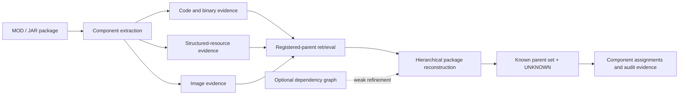
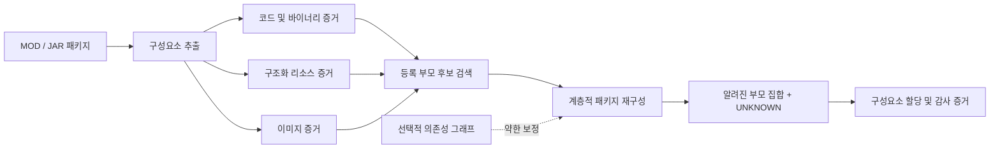
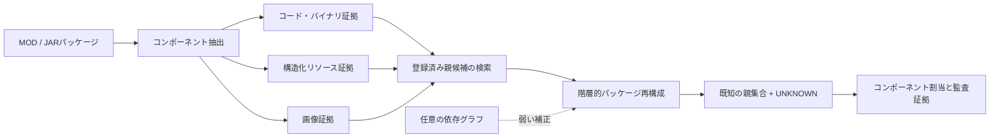

# MOD Provenance Reconstruction

[](reproducibility/EXPERIMENT_INDEX.md#user-content-experiment-en)
[](reproducibility/EXPERIMENT_INDEX.md#freeze-anchors)
[](REPRODUCE.md#user-content-reproduce-en)

## Languages

[](#user-content-readme-en) [](#user-content-readme-ko) [](#user-content-readme-ja)

<a id="readme-en"></a>

An academic research repository for reconstructing the likely provenance of components inside a recomposed MOD/JAR package. The system combines identity-neutral evidence from code/binaries, structured resources, and images; retrieves candidate registered projects; reconstructs a package-level parent set; and assigns unsupported components to a public `UNKNOWN` label.

> [!IMPORTANT]
> This is a technical provenance and evidence-reconstruction system. It does **not** determine copyright ownership, infringement, permission, or legal liability. Its outputs are intended to support expert and human review.

## Research question

Can the component-level origins of a recomposed software package be reconstructed when the package may contain material from multiple registered projects as well as previously unseen sources?

This matters because path names, package metadata, and project identifiers are easy to remove or rewrite during redistribution. A useful provenance method therefore has to work from content evidence, preserve uncertainty, and explain results at both component and whole-package levels.

## System overview



Content evidence is the primary signal. The dependency graph is an optional weak refinement; its TEST effect on the primary parent-set metric was small and statistically inconclusive.

## Method at a glance

1. Build public project and release registries, while retaining raw downloadable payloads locally.
2. Extract identity-neutral evidence from code/binary, structured-resource, and image components.
3. Retrieve a fixed candidate pool of registered parent projects for each query package.
4. Jointly select the package-level parent set and assign each component to a selected parent or `UNKNOWN`.
5. Freeze the benchmark, parameters, manifests, and hashes before opening the final TEST split.
6. Evaluate uncertainty, baselines, external clone detection, deployment behavior, robustness, retrieval scalability, and failure localization without retuning the frozen method.

## Research contributions

- A heterogeneous component-provenance formulation that combines registered-parent attribution with open-set `UNKNOWN` rejection.
- A hierarchical reconstruction method that links component assignments to a coherent package-level parent set.
- A frozen 120-project benchmark with public/private manifest separation, hash verification, and leakage audits.
- Query-level bootstrap, ablation, source-cluster sensitivity, server correctness, and host-specific performance analyses.
- External NiCadCross comparison on a strictly source-resolvable code subset, plus compatibility preparation for StoneDetector.
- Post-freeze multi-unknown robustness, approximate-retrieval scalability, and hierarchical failure-localization studies.

## Research progress

All Phase 1-13 scripts and reportable outputs are preserved on `main`. “Complete” means the recorded phase artifacts exist; only Phase 6 onward forms the frozen confirmatory benchmark.

| Phase | Scope | Status |
|---:|---|:---:|
| 1 | Pilot collection and 30-project real-MOD corpus | Complete |
| 2 | Source/release registries and duplicate audits | Complete |
| 3 | Version-drift and bytecode/content baselines | Complete |
| 4 | Dependency and resource-reference graphs | Complete |
| 5 | Exploratory multi-parent hierarchical reconstruction | Complete |
| 6 | Fresh 120-project corpus, frozen splits, 540 queries, and materialization | **Frozen** |
| 7 | Calibration, method freeze, and final TEST evaluation | **Frozen** |
| 8 | Bootstrap statistics, ablations, and source-cluster sensitivity | Complete |
| 9 | Server correctness, concurrency, end-to-end, and gallery scaling | Complete |
| 10 | NiCadCross external comparison and StoneDetector compatibility | Complete |
| 11 | Controlled multiple-unknown-source robustness | Complete |
| 12 | Exact versus binary-LSH retrieval and scalability | Complete |
| 13 | Post-freeze automated failure analysis | Complete |

The detailed script → input → output → result → freeze map is in the [Experiment Index](reproducibility/EXPERIMENT_INDEX.md#user-content-experiment-en).

## Key results

### Frozen Phase 7 TEST

The final evaluation contains 360 queries and 2,520 components. The graph-refined result is the frozen final method; content-only is retained as the primary signal and ablation reference.

| Track | Component accuracy | `UNKNOWN` F1 | Parent-set F1 | Parent-set exact | K accuracy |
|---|---:|---:|---:|---:|---:|
| Frozen final, graph-refined | 0.805952 | 0.753786 | 0.844233 | 0.419444 | 0.486111 |
| Content-only | 0.807143 | 0.752386 | 0.843545 | 0.413889 | 0.480556 |

Candidate retrieval reached 0.974444 mean known-parent recall, with every known parent present for 0.943333 of known-parent queries. Hierarchical content improved parent-set F1 by 0.046133 over independent component decisions. The graph-minus-content parent-set F1 delta was +0.000688, and its 95% query-bootstrap confidence interval included zero.

### System and external validation

| Evaluation | Scope | Headline result |
|---|---|---|
| Server correctness | 360 queries / 2,520 components | Predictions matched the frozen reference for every query and component. |
| Precomputed-score server | Best measured concurrency | 86.21 requests/s. |
| Evidence → search → reconstruction | Concurrency 1 | Server p50 12.579 ms; search 11.493 ms; reconstruction 1.088 ms. |
| Local package → result | Concurrency 1 | Server p50 26.880 ms; extraction 14.440 ms; search 10.685 ms. |
| Gallery scaling | 20 → 100 real projects | Sequential search p50 4.353 → 21.457 ms. |
| NiCadCross paired subset | 1,169 source-resolvable code components | Proposed 0.841 vs NiCadCross 0.710 component accuracy; delta +0.131, paired 95% CI 0.096-0.167. |

Phase 11 adds a controlled 180-query / 1,260-component recomposition analysis: component accuracy 0.841, `UNKNOWN` F1 0.888, and collapsed parent-set F1 0.884. Because the frozen model emits one public `UNKNOWN` label, these numbers measure rejection of unregistered components—not recovery of distinct unknown identities or multiplicity.

Phase 12 found that BALANCED and HIGH_RECALL binary-LSH configurations preserved Exact predictions on all 360 frozen TEST queries. FAST changed 1/360 query prediction and 1/2,520 component prediction, while reducing the 60-project runtime-sample p50 from 10.315 ms to 8.848 ms (1.166×). The `200eq`/`500eq`/`1000eq` conditions are synthetic component-volume stresses over 100 real registered parents, not additional unique MOD projects.

Phase 13 localized 489 frozen TEST component errors: component assignment 325 (66.46%), `UNKNOWN` rejection 81 (16.56%), parent selection 47 (9.61%), and retrieval 36 (7.36%). It is diagnostic only and does not recompute predictions or change the method.

## Repository map

```text
scripts/             Phase 1-13 collection, calibration, evaluation, and audit scripts
server/              Phase 9 FastAPI research services
tools/               Tracked helper source and tool configuration
results/             Curated summaries, audits, predictions, and frozen manifests
reproducibility/     Environment records, hashes, freeze manifests, and experiment index
paper/               Paper-oriented figure and reporting scripts
archive/             Historical generated, superseded, and known-bug artifacts retained for audit
data/                Registries and redistributable metadata; raw payload bytes remain ignored
```

Raw MOD/JAR payloads, reconstructed external-tool corpora, private held-out mappings not approved for release, caches, generated server data, compiled files, and virtual environments are intentionally excluded from Git. See [Tracking Audit](reproducibility/TRACKING_AUDIT.md#user-content-tracking-en) for the preservation policy and historical classification.

## Reproduction and freeze anchors

- [Reproduction guide](REPRODUCE.md#user-content-reproduce-en)
- [Experiment index](reproducibility/EXPERIMENT_INDEX.md#user-content-experiment-en)
- [Environment record](reproducibility/ENVIRONMENT.md#user-content-environment-en)
- [Tracking audit](reproducibility/TRACKING_AUDIT.md#user-content-tracking-en)
- [Contribution guide](CONTRIBUTING.md#user-content-contributing-en)
- [Archive notes](archive/README.md#user-content-archive-en)
- [Phase 12 freeze manifest](reproducibility/phase12_freeze_manifest.sha256)
- [Phase 13 freeze manifest](reproducibility/phase13_freeze_manifest.sha256)

Core Phase 6-7 anchors include the frozen split, query manifest and ground truth, payload-hash manifest, graph tracks, and `results/phase7g_final_method_parameters.json`. The frozen parameter SHA-256 is `caad17257304d0ab198e01ef327f5acf918e6b8aab3f00e5272be3d20d3f8325`.

## Responsible interpretation

- Do not infer legal ownership, copying, license compliance, or infringement from a provenance score alone.
- Do not claim the graph refinement is a statistically established improvement on the primary TEST metric.
- Do not compare the Phase 9 latency scopes as if they measured the same pipeline.
- NiCadCross receives reconstructed Java source while the proposed system uses frozen binary-side evidence; the comparison is restricted to the same source-resolvable subset.
- StoneDetector artifacts document compatibility preparation, not a completed comparative effectiveness result.
- Do not use Phase 7 TEST, Phase 11 recompositions, Phase 12 operating points, or Phase 13 diagnostics to retune the frozen method.

## Data, citation, license, and contact

The repository is kept private while held-out mappings and redistribution-sensitive research artifacts are reviewed. “Private” benchmark files refer to model-private evaluation labels; they are not credentials and must still be handled as sensitive research data.

The paper is under preparation. Until formal bibliographic metadata is finalized, cite this repository together with the exact commit hash used for reproduction. No repository-wide license has yet been declared; do not assume that source code, datasets, MOD/JAR payloads, or third-party materials are licensed for redistribution. Original third-party licenses remain controlling.

For research questions or reproducibility reports, use the repository's GitHub Issues. For private contact, use the [repository owner's GitHub profile](https://github.com/YSL-RyuDo).

---

<a id="readme-ko"></a>

# MOD 출처 재구성 연구

[](#user-content-readme-en) [](#user-content-readme-ko) [](#user-content-readme-ja)

재조합된 MOD/JAR 패키지 내부 구성요소의 가능한 출처를 재구성하는 학술 연구 저장소입니다. 시스템은 코드/바이너리, 구조화 리소스, 이미지에서 프로젝트 식별자에 의존하지 않는 증거를 결합하고, 등록된 후보 프로젝트를 검색한 뒤, 패키지 수준의 부모 집합을 재구성합니다. 등록된 출처로 뒷받침되지 않는 구성요소에는 공개 레이블인 `UNKNOWN`을 부여합니다.

> [!IMPORTANT]
> 이 시스템은 기술적 출처와 증거를 재구성하기 위한 도구입니다. 저작권 소유권, 침해 여부, 허락의 존재 또는 법적 책임을 **판단하지 않습니다**. 출력은 전문가와 사람의 검토를 보조하기 위한 것입니다.

## 연구 질문

여러 등록 프로젝트의 자료와 이전에 관찰하지 못한 출처의 자료가 함께 들어 있을 수 있는 재조합 소프트웨어 패키지에서, 각 구성요소의 출처를 재구성할 수 있는가?

재배포 과정에서는 경로명, 패키지 메타데이터, 프로젝트 식별자를 쉽게 제거하거나 바꿀 수 있습니다. 따라서 실용적인 출처 추적 방법은 내용 증거를 사용하고, 불확실성을 보존하며, 구성요소 수준과 전체 패키지 수준의 결과를 함께 설명할 수 있어야 합니다.

## 시스템 개요



내용 증거가 주된 신호입니다. 의존성 그래프는 선택적인 약한 보정으로만 사용되며, 1차 부모 집합 지표에 대한 TEST 효과는 작고 통계적으로 확정적이지 않았습니다.

## 연구 방법 요약

1. 공개 프로젝트 및 릴리스 레지스트리를 구축하고, 다운로드한 원본 payload는 로컬에만 보관합니다.
2. 코드/바이너리, 구조화 리소스, 이미지 구성요소에서 식별자 중립적인 증거를 추출합니다.
3. 각 질의 패키지에 대해 고정된 수의 등록 부모 후보를 검색합니다.
4. 패키지 수준 부모 집합을 공동으로 선택하고 각 구성요소를 선택된 부모 또는 `UNKNOWN`에 할당합니다.
5. 최종 TEST를 열기 전에 벤치마크, 매개변수, manifest, 해시를 동결합니다.
6. 동결된 방법을 재조정하지 않고 불확실성, baseline, 외부 clone detector, 배포 성능, 강건성, 검색 확장성, 실패 위치를 평가합니다.

## 연구 기여

- 등록 부모 귀속과 open-set `UNKNOWN` 거부를 결합한 이질적 구성요소 출처 문제 정의
- 구성요소 할당을 일관된 패키지 수준 부모 집합과 연결하는 계층적 재구성 방법
- 공개/비공개 manifest 분리, 해시 검증, 누수 감사를 갖춘 120개 프로젝트 동결 벤치마크
- 질의 단위 bootstrap, ablation, 출처-cluster 민감도, 서버 정확성 및 host 종속 성능 분석
- 엄격히 source-resolvable한 코드 부분집합에서의 NiCadCross 비교와 StoneDetector 호환성 준비
- 동결 이후의 다중 미등록 출처 강건성, 근사 검색 확장성, 계층적 실패 위치 분석

## 연구 진행 현황

Phase 1-13의 모든 스크립트와 보고 가능한 결과가 `main`에 보존되어 있습니다. “완료”는 해당 단계의 기록물이 존재한다는 뜻이며, 동결된 확인적 벤치마크는 Phase 6부터 시작합니다.

| Phase | 범위 | 상태 |
|---:|---|:---:|
| 1 | 예비 수집 및 30개 실제 MOD corpus | 완료 |
| 2 | 소스/릴리스 레지스트리와 중복 감사 | 완료 |
| 3 | 버전 변화 및 bytecode/content baseline | 완료 |
| 4 | 의존성과 리소스 참조 그래프 | 완료 |
| 5 | 탐색적 다중 부모 계층 재구성 | 완료 |
| 6 | 신규 120개 프로젝트 corpus, 동결 split, 540개 질의 및 materialization | **동결** |
| 7 | calibration, 방법 동결 및 최종 TEST 평가 | **동결** |
| 8 | bootstrap 통계, ablation, 출처-cluster 민감도 | 완료 |
| 9 | 서버 정확성, 동시성, end-to-end 및 gallery 확장성 | 완료 |
| 10 | NiCadCross 외부 비교 및 StoneDetector 호환성 | 완료 |
| 11 | 통제된 다중 미등록 출처 강건성 | 완료 |
| 12 | Exact 대 binary-LSH 검색 및 확장성 | 완료 |
| 13 | 동결 후 자동 실패 분석 | 완료 |

각 Phase의 script → input → output → 핵심 결과 → 동결 여부는 [실험 인덱스](reproducibility/EXPERIMENT_INDEX.md#user-content-experiment-ko)에 정리되어 있습니다.

## 핵심 결과

### 동결된 Phase 7 TEST

최종 평가는 360개 질의와 2,520개 구성요소로 이루어집니다. 그래프 보정 결과가 동결된 최종 방법이며, content-only 결과는 주된 신호와 ablation 기준으로 함께 보존됩니다.

| Track | 구성요소 정확도 | `UNKNOWN` F1 | 부모 집합 F1 | 부모 집합 완전일치 | K 정확도 |
|---|---:|---:|---:|---:|---:|
| 동결 최종, 그래프 보정 | 0.805952 | 0.753786 | 0.844233 | 0.419444 | 0.486111 |
| Content-only | 0.807143 | 0.752386 | 0.843545 | 0.413889 | 0.480556 |

후보 검색의 평균 알려진 부모 recall은 0.974444였고, 알려진 부모가 있는 질의의 0.943333에서 모든 실제 부모가 후보에 포함되었습니다. 계층적 content 방법은 독립 구성요소 판정보다 부모 집합 F1을 0.046133 높였습니다. 그래프 보정과 content-only의 부모 집합 F1 차이는 +0.000688이었으며, 95% 질의 bootstrap 신뢰구간은 0을 포함했습니다.

### 시스템 및 외부 검증

| 평가 | 범위 | 핵심 결과 |
|---|---|---|
| 서버 정확성 | 360개 질의 / 2,520개 구성요소 | 모든 질의와 구성요소에서 동결 기준 예측과 일치했습니다. |
| 사전 계산 점수 서버 | 측정된 최적 동시성 | 86.21 requests/s |
| 증거 → 검색 → 재구성 | 동시성 1 | 서버 p50 12.579 ms, 검색 11.493 ms, 재구성 1.088 ms |
| 로컬 패키지 → 결과 | 동시성 1 | 서버 p50 26.880 ms, 추출 14.440 ms, 검색 10.685 ms |
| Gallery 확장 | 실제 프로젝트 20 → 100개 | 순차 검색 p50 4.353 → 21.457 ms |
| NiCadCross 대응 부분집합 | source-resolvable 코드 구성요소 1,169개 | 제안 방법 0.841 대 NiCadCross 0.710; 차이 +0.131, paired 95% CI 0.096-0.167 |

Phase 11은 통제된 재조합 180개 질의/1,260개 구성요소 분석을 추가했습니다. 구성요소 정확도 0.841, `UNKNOWN` F1 0.888, collapsed 부모 집합 F1 0.884입니다. 동결 모델은 공개 `UNKNOWN` 레이블을 하나만 출력하므로, 이 수치는 미등록 구성요소의 거부 성능을 측정할 뿐 서로 다른 미등록 출처의 정체나 개수를 복원하는 성능을 뜻하지 않습니다.

Phase 12에서는 BALANCED와 HIGH_RECALL binary-LSH가 동결 TEST 360개 전체에서 Exact와 같은 최종 예측을 유지했습니다. FAST는 360개 중 질의 예측 1개와 2,520개 중 구성요소 예측 1개를 바꾸면서, 60개 프로젝트 runtime sample의 p50을 10.315 ms에서 8.848 ms로 줄였습니다(1.166배). `200eq`/`500eq`/`1000eq`는 실제 등록 부모 100개를 사용한 합성 구성요소 부하 실험이며, 고유한 실제 MOD 프로젝트 수가 아닙니다.

Phase 13은 동결 TEST의 오류 489개를 구성요소 할당 325개(66.46%), `UNKNOWN` 거부 81개(16.56%), 부모 선택 47개(9.61%), 검색 36개(7.36%)로 위치화했습니다. 이 단계는 진단 전용이며 예측을 다시 계산하거나 방법을 바꾸지 않습니다.

## 저장소 구성

```text
scripts/             Phase 1-13 수집, calibration, 평가 및 감사 스크립트
server/              Phase 9 FastAPI 연구 서버
tools/               추적되는 보조 소스와 도구 설정
results/             선별된 summary, audit, prediction, 동결 manifest
reproducibility/     환경 기록, 해시, 동결 manifest, 실험 색인
paper/               논문용 그림 및 보고 스크립트
archive/             감사를 위해 보존한 생성물, 대체된 버전, 알려진 bug 버전
data/                레지스트리와 재배포 가능한 메타데이터; 원본 payload byte는 제외
```

원본 MOD/JAR payload, 외부 도구용 복원 corpus, 공개 승인을 받지 않은 비공개 held-out mapping, cache, 생성 서버 데이터, compiled 파일, 가상환경은 의도적으로 Git에서 제외합니다. 보존 정책과 과거 파일 분류는 [추적 감사](reproducibility/TRACKING_AUDIT.md#user-content-tracking-ko)를 참고하세요.

## 재현 및 동결 기준점

- [재현 안내](REPRODUCE.md#user-content-reproduce-ko)
- [실험 인덱스](reproducibility/EXPERIMENT_INDEX.md#user-content-experiment-ko)
- [환경 기록](reproducibility/ENVIRONMENT.md#user-content-environment-ko)
- [추적 감사](reproducibility/TRACKING_AUDIT.md#user-content-tracking-ko)
- [기여 안내](CONTRIBUTING.md#user-content-contributing-ko)
- [Archive 설명](archive/README.md#user-content-archive-ko)
- [Phase 12 동결 manifest](reproducibility/phase12_freeze_manifest.sha256)
- [Phase 13 동결 manifest](reproducibility/phase13_freeze_manifest.sha256)

Phase 6-7의 핵심 기준점은 동결 split, 질의 manifest와 ground truth, payload 해시 manifest, 그래프 track, `results/phase7g_final_method_parameters.json`입니다. 동결 매개변수 SHA-256은 `caad17257304d0ab198e01ef327f5acf918e6b8aab3f00e5272be3d20d3f8325`입니다.

## 책임 있는 해석

- 출처 점수만으로 법적 소유권, 복제, 라이선스 준수 또는 침해 여부를 추론하지 마세요.
- 그래프 보정이 1차 TEST 지표를 통계적으로 확립된 수준으로 개선했다고 주장하지 마세요.
- Phase 9의 서로 다른 latency 범위를 같은 pipeline 측정치처럼 비교하지 마세요.
- NiCadCross에는 복원된 Java source가 제공되지만 제안 시스템은 동결 binary-side 증거를 사용합니다. 비교는 동일한 source-resolvable 부분집합으로 제한됩니다.
- StoneDetector 기록은 호환성 준비 결과이며 비교 효과 평가의 완료를 뜻하지 않습니다.
- Phase 7 TEST, Phase 11 재조합, Phase 12 operating point, Phase 13 진단을 동결 방법 재조정에 사용하지 마세요.

## 데이터, 인용, 라이선스 및 문의

Held-out mapping과 재배포에 민감한 연구 자료를 검토하는 동안 저장소는 비공개로 유지합니다. 벤치마크에서 “private” 파일은 모델에 공개되지 않는 평가 정답을 뜻하며 credential이 아닙니다. 그래도 민감한 연구 데이터로 취급해야 합니다.

논문은 준비 중입니다. 정식 서지정보가 확정되기 전에는 재현에 사용한 정확한 commit hash와 이 저장소를 함께 인용하세요. 현재 저장소 전체에 적용되는 라이선스는 선언되지 않았습니다. 소스 코드, 데이터셋, MOD/JAR payload 또는 제3자 자료의 재배포 권한이 있다고 추정하지 마세요. 제3자의 원래 라이선스가 우선합니다.

연구 질문과 재현성 보고는 저장소의 GitHub Issues를 이용해 주세요. 비공개 문의는 [저장소 소유자의 GitHub 프로필](https://github.com/YSL-RyuDo)을 이용할 수 있습니다.

---

<a id="readme-ja"></a>

# MOD来歴再構成研究

[](#user-content-readme-en) [](#user-content-readme-ko) [](#user-content-readme-ja)

再構成されたMOD/JARパッケージ内の各コンポーネントについて、もっともらしい由来を復元する学術研究リポジトリです。本システムは、コード／バイナリ、構造化リソース、画像からプロジェクト識別子に依存しない証拠を統合し、登録済み候補プロジェクトを検索したうえで、パッケージ単位の親集合を再構成します。登録済みの由来では裏付けられないコンポーネントには、公開ラベル `UNKNOWN` を割り当てます。

> [!IMPORTANT]
> 本システムは、技術的な来歴と証拠を再構成するためのものです。著作権の帰属、侵害、許諾、または法的責任を**判断するものではありません**。出力は、専門家および人による検討を支援するためのものです。

## 研究課題

複数の登録済みプロジェクト由来の素材と、未知の由来の素材を同時に含み得る再構成ソフトウェアパッケージから、コンポーネント単位の由来を復元できるか。

再配布の過程では、パス名、パッケージメタデータ、プロジェクト識別子を容易に削除・変更できます。そのため実用的な来歴推定には、内容に基づく証拠を利用し、不確実性を保持し、コンポーネント単位とパッケージ全体の両方で結果を説明できることが必要です。

## システム概要



内容証拠が主要な信号です。依存グラフは任意の弱い補正としてのみ使用され、主要な親集合指標に対するTESTでの効果は小さく、統計的に決定的ではありませんでした。

## 手法の概要

1. 公開プロジェクトおよびリリースのレジストリを構築し、ダウンロードした生のpayloadはローカルに保持します。
2. コード／バイナリ、構造化リソース、画像の各コンポーネントから、識別子に依存しない証拠を抽出します。
3. 各クエリパッケージに対して、固定数の登録済み親候補を検索します。
4. パッケージ単位の親集合を共同選択し、各コンポーネントを選択された親または `UNKNOWN` に割り当てます。
5. 最終TESTを開く前に、ベンチマーク、パラメータ、manifest、ハッシュを凍結します。
6. 凍結手法を再調整せず、不確実性、baseline、外部clone detector、配備性能、頑健性、検索のスケーラビリティ、失敗箇所を評価します。

## 研究上の貢献

- 登録済み親への帰属とopen-set `UNKNOWN` 棄却を統合した、異種コンポーネント来歴問題の定式化
- コンポーネント割当を整合的なパッケージ単位の親集合に結び付ける階層的再構成手法
- 公開／非公開manifestの分離、ハッシュ検証、漏洩監査を備えた120プロジェクトの凍結ベンチマーク
- クエリ単位bootstrap、ablation、由来cluster感度、サーバー正確性、host依存性能の分析
- 厳密にsource-resolvableなコード部分集合でのNiCadCross比較と、StoneDetector互換性の準備
- 凍結後の複数未知由来に対する頑健性、近似検索のスケーラビリティ、階層的失敗箇所の分析

## 研究の進捗

Phase 1-13の全スクリプトと報告可能な結果が `main` に保存されています。「完了」は各Phaseの記録物が存在することを意味し、凍結された確認的ベンチマークはPhase 6から始まります。

| Phase | 対象 | 状況 |
|---:|---|:---:|
| 1 | 予備収集と30件の実MOD corpus | 完了 |
| 2 | ソース／リリースレジストリと重複監査 | 完了 |
| 3 | バージョン変動とbytecode/content baseline | 完了 |
| 4 | 依存・リソース参照グラフ | 完了 |
| 5 | 探索的な複数親の階層再構成 | 完了 |
| 6 | 新規120プロジェクトcorpus、凍結split、540クエリ、materialization | **凍結** |
| 7 | calibration、手法凍結、最終TEST評価 | **凍結** |
| 8 | bootstrap統計、ablation、由来cluster感度 | 完了 |
| 9 | サーバー正確性、並行性、end-to-end、galleryスケーリング | 完了 |
| 10 | NiCadCross外部比較とStoneDetector互換性 | 完了 |
| 11 | 制御された複数未知由来への頑健性 | 完了 |
| 12 | Exact対binary-LSH検索とスケーラビリティ | 完了 |
| 13 | 凍結後の自動失敗分析 | 完了 |

Phaseごとのscript → input → output → 主要結果 → 凍結状況は、[実験インデックス](reproducibility/EXPERIMENT_INDEX.md#user-content-experiment-ja)に整理しています。

## 主要結果

### 凍結済みPhase 7 TEST

最終評価は360クエリ、2,520コンポーネントで構成されます。グラフ補正を含む結果が凍結済みの最終手法であり、content-onlyの結果は主要信号およびablationの基準として併記しています。

| Track | コンポーネント正解率 | `UNKNOWN` F1 | 親集合F1 | 親集合完全一致 | K正解率 |
|---|---:|---:|---:|---:|---:|
| 凍結最終・グラフ補正 | 0.805952 | 0.753786 | 0.844233 | 0.419444 | 0.486111 |
| Content-only | 0.807143 | 0.752386 | 0.843545 | 0.413889 | 0.480556 |

候補検索では既知親の平均recallが0.974444となり、既知親を含むクエリの0.943333で全ての正解親が候補に含まれました。階層的content手法は、独立コンポーネント判定に比べて親集合F1を0.046133向上させました。グラフ補正とcontent-onlyの親集合F1差は+0.000688で、95%クエリbootstrap信頼区間は0を含みました。

### システムおよび外部検証

| 評価 | 対象 | 主要結果 |
|---|---|---|
| サーバー正確性 | 360クエリ / 2,520コンポーネント | 全クエリ・コンポーネントで凍結参照予測と一致しました。 |
| 事前計算スコアサーバー | 測定上の最良並行度 | 86.21 requests/s |
| 証拠 → 検索 → 再構成 | 並行度1 | サーバーp50 12.579 ms、検索11.493 ms、再構成1.088 ms |
| ローカルパッケージ → 結果 | 並行度1 | サーバーp50 26.880 ms、抽出14.440 ms、検索10.685 ms |
| Galleryスケーリング | 実プロジェクト20 → 100件 | 逐次検索p50 4.353 → 21.457 ms |
| NiCadCross対応部分集合 | source-resolvableなコード1,169件 | 提案手法0.841、NiCadCross 0.710、差+0.131、paired 95% CI 0.096-0.167 |

Phase 11では、制御された再構成による180クエリ／1,260コンポーネントの分析を追加しました。コンポーネント正解率0.841、`UNKNOWN` F1 0.888、collapsed親集合F1 0.884です。凍結モデルは公開 `UNKNOWN` ラベルを1つだけ出力するため、これらは未登録コンポーネントの棄却性能を示すものであり、異なる未知由来の同定や個数の復元性能ではありません。

Phase 12では、BALANCEDおよびHIGH_RECALLのbinary-LSHが、凍結TESTの全360クエリでExactと同じ最終予測を維持しました。FASTは360クエリ中1件、2,520コンポーネント中1件の予測を変更し、60プロジェクトruntime sampleのp50を10.315 msから8.848 msへ短縮しました（1.166倍）。`200eq`/`500eq`/`1000eq`は、100件の実登録親を使った合成コンポーネント量の負荷試験であり、追加の固有実MODプロジェクト数ではありません。

Phase 13では、凍結TESTの489件のエラーを、コンポーネント割当325件（66.46%）、`UNKNOWN` 棄却81件（16.56%）、親選択47件（9.61%）、検索36件（7.36%）に局在化しました。このPhaseは診断専用であり、予測の再計算や手法変更は行いません。

## リポジトリ構成

```text
scripts/             Phase 1-13の収集、calibration、評価、監査スクリプト
server/              Phase 9 FastAPI研究サーバー
tools/               追跡対象の補助ソースとツール設定
results/             選別されたsummary、audit、prediction、凍結manifest
reproducibility/     環境記録、ハッシュ、凍結manifest、実験インデックス
paper/               論文用の図表・報告スクリプト
archive/             監査用に保存した生成物、旧版、既知bug版
data/                レジストリと再配布可能なメタデータ。生payload byteは除外
```

生のMOD/JAR payload、外部ツール用に再構成したcorpus、公開承認を受けていない非公開held-out mapping、cache、生成されたサーバーデータ、compiledファイル、仮想環境は意図的にGitから除外しています。保存方針と過去ファイルの分類は[追跡監査](reproducibility/TRACKING_AUDIT.md#user-content-tracking-ja)を参照してください。

## 再現と凍結アンカー

- [再現ガイド](REPRODUCE.md#user-content-reproduce-ja)
- [実験インデックス](reproducibility/EXPERIMENT_INDEX.md#user-content-experiment-ja)
- [環境記録](reproducibility/ENVIRONMENT.md#user-content-environment-ja)
- [追跡監査](reproducibility/TRACKING_AUDIT.md#user-content-tracking-ja)
- [コントリビューションガイド](CONTRIBUTING.md#user-content-contributing-ja)
- [Archive説明](archive/README.md#user-content-archive-ja)
- [Phase 12凍結manifest](reproducibility/phase12_freeze_manifest.sha256)
- [Phase 13凍結manifest](reproducibility/phase13_freeze_manifest.sha256)

Phase 6-7の主要アンカーには、凍結split、クエリmanifestとground truth、payloadハッシュmanifest、グラフtrack、`results/phase7g_final_method_parameters.json` が含まれます。凍結パラメータのSHA-256は `caad17257304d0ab198e01ef327f5acf918e6b8aab3f00e5272be3d20d3f8325` です。

## 責任ある解釈

- 来歴スコアだけから、法的所有権、複製、ライセンス遵守、侵害を推定しないでください。
- グラフ補正が主要TEST指標を統計的に確立された形で改善したと主張しないでください。
- Phase 9の異なるlatency範囲を同一pipelineの測定値として比較しないでください。
- NiCadCrossには再構成したJava sourceを与えますが、提案システムは凍結binary-side証拠を用います。比較は同一のsource-resolvable部分集合に限定されます。
- StoneDetector成果物は互換性準備の記録であり、比較有効性評価の完了を意味しません。
- Phase 7 TEST、Phase 11再構成、Phase 12 operating point、Phase 13診断を凍結手法の再調整に使用しないでください。

## データ、引用、ライセンス、連絡先

Held-out mappingと再配布に配慮が必要な研究資料を確認している間、リポジトリは非公開に保ちます。ベンチマークの「private」ファイルはモデルから隠された評価ラベルを意味し、credentialではありません。それでも機微な研究データとして取り扱う必要があります。

論文は準備中です。正式な書誌情報が確定するまでは、再現に使用した正確なcommit hashと本リポジトリを併記して引用してください。現時点ではリポジトリ全体のライセンスは宣言されていません。ソースコード、データセット、MOD/JAR payload、第三者資料の再配布が許可されていると推定しないでください。第三者の元のライセンスが優先されます。

研究上の質問や再現性の報告には、リポジトリのGitHub Issuesを利用してください。非公開の連絡には、[リポジトリ所有者のGitHubプロフィール](https://github.com/YSL-RyuDo)を利用できます。
