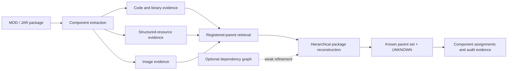

# MOD Provenance Reconstruction

[](reproducibility/EXPERIMENT_INDEX.md)
[](reproducibility/EXPERIMENT_INDEX.md#freeze-anchors)
[](REPRODUCE.md)
[](#languages)

## Languages

**English** · [한국어](README.ko.md) · [日本語](README.ja.md)

An academic research repository for reconstructing the likely provenance of components inside a recomposed MOD/JAR package. The system combines identity-neutral evidence from code/binaries, structured resources, and images; retrieves candidate registered projects; reconstructs a package-level parent set; and assigns unsupported components to a public `UNKNOWN` label.

> [!IMPORTANT]
> This is a technical provenance and evidence-reconstruction system. It does **not** determine copyright ownership, infringement, permission, or legal liability. Its outputs are intended to support expert and human review.

## Research question

Can the component-level origins of a recomposed software package be reconstructed when the package may contain material from multiple registered projects as well as previously unseen sources?

This matters because path names, package metadata, and project identifiers are easy to remove or rewrite during redistribution. A useful provenance method therefore has to work from content evidence, preserve uncertainty, and explain results at both component and whole-package levels.

## System overview



Content evidence is the primary signal. The dependency graph is an optional weak refinement; its TEST effect on the primary parent-set metric was small and statistically inconclusive.

## Method at a glance

1. Build public project and release registries, while retaining raw downloadable payloads locally.
2. Extract identity-neutral evidence from code/binary, structured-resource, and image components.
3. Retrieve a fixed candidate pool of registered parent projects for each query package.
4. Jointly select the package-level parent set and assign each component to a selected parent or `UNKNOWN`.
5. Freeze the benchmark, parameters, manifests, and hashes before opening the final TEST split.
6. Evaluate uncertainty, baselines, external clone detection, deployment behavior, robustness, retrieval scalability, and failure localization without retuning the frozen method.

## Research contributions

- A heterogeneous component-provenance formulation that combines registered-parent attribution with open-set `UNKNOWN` rejection.
- A hierarchical reconstruction method that links component assignments to a coherent package-level parent set.
- A frozen 120-project benchmark with public/private manifest separation, hash verification, and leakage audits.
- Query-level bootstrap, ablation, source-cluster sensitivity, server correctness, and host-specific performance analyses.
- External NiCadCross comparison on a strictly source-resolvable code subset, plus compatibility preparation for StoneDetector.
- Post-freeze multi-unknown robustness, approximate-retrieval scalability, and hierarchical failure-localization studies.

## Research progress

All Phase 1-13 scripts and reportable outputs are preserved on `main`. “Complete” means the recorded phase artifacts exist; only Phase 6 onward forms the frozen confirmatory benchmark.

| Phase | Scope | Status |
|---:|---|:---:|
| 1 | Pilot collection and 30-project real-MOD corpus | Complete |
| 2 | Source/release registries and duplicate audits | Complete |
| 3 | Version-drift and bytecode/content baselines | Complete |
| 4 | Dependency and resource-reference graphs | Complete |
| 5 | Exploratory multi-parent hierarchical reconstruction | Complete |
| 6 | Fresh 120-project corpus, frozen splits, 540 queries, and materialization | **Frozen** |
| 7 | Calibration, method freeze, and final TEST evaluation | **Frozen** |
| 8 | Bootstrap statistics, ablations, and source-cluster sensitivity | Complete |
| 9 | Server correctness, concurrency, end-to-end, and gallery scaling | Complete |
| 10 | NiCadCross external comparison and StoneDetector compatibility | Complete |
| 11 | Controlled multiple-unknown-source robustness | Complete |
| 12 | Exact versus binary-LSH retrieval and scalability | Complete |
| 13 | Post-freeze automated failure analysis | Complete |

The detailed script → input → output → result → freeze map is in the [Experiment Index](reproducibility/EXPERIMENT_INDEX.md).

## Key results

### Frozen Phase 7 TEST

The final evaluation contains 360 queries and 2,520 components. The graph-refined result is the frozen final method; content-only is retained as the primary signal and ablation reference.

| Track | Component accuracy | `UNKNOWN` F1 | Parent-set F1 | Parent-set exact | K accuracy |
|---|---:|---:|---:|---:|---:|
| Frozen final, graph-refined | 0.805952 | 0.753786 | 0.844233 | 0.419444 | 0.486111 |
| Content-only | 0.807143 | 0.752386 | 0.843545 | 0.413889 | 0.480556 |

Candidate retrieval reached 0.974444 mean known-parent recall, with every known parent present for 0.943333 of known-parent queries. Hierarchical content improved parent-set F1 by 0.046133 over independent component decisions. The graph-minus-content parent-set F1 delta was +0.000688, and its 95% query-bootstrap confidence interval included zero.

### System and external validation

| Evaluation | Scope | Headline result |
|---|---|---|
| Server correctness | 360 queries / 2,520 components | Predictions matched the frozen reference for every query and component. |
| Precomputed-score server | Best measured concurrency | 86.21 requests/s. |
| Evidence → search → reconstruction | Concurrency 1 | Server p50 12.579 ms; search 11.493 ms; reconstruction 1.088 ms. |
| Local package → result | Concurrency 1 | Server p50 26.880 ms; extraction 14.440 ms; search 10.685 ms. |
| Gallery scaling | 20 → 100 real projects | Sequential search p50 4.353 → 21.457 ms. |
| NiCadCross paired subset | 1,169 source-resolvable code components | Proposed 0.841 vs NiCadCross 0.710 component accuracy; delta +0.131, paired 95% CI 0.096-0.167. |

Phase 11 adds a controlled 180-query / 1,260-component recomposition analysis: component accuracy 0.841, `UNKNOWN` F1 0.888, and collapsed parent-set F1 0.884. Because the frozen model emits one public `UNKNOWN` label, these numbers measure rejection of unregistered components—not recovery of distinct unknown identities or multiplicity.

Phase 12 found that BALANCED and HIGH_RECALL binary-LSH configurations preserved Exact predictions on all 360 frozen TEST queries. FAST changed 1/360 query prediction and 1/2,520 component prediction, while reducing the 60-project runtime-sample p50 from 10.315 ms to 8.848 ms (1.166×). The `200eq`/`500eq`/`1000eq` conditions are synthetic component-volume stresses over 100 real registered parents, not additional unique MOD projects.

Phase 13 localized 489 frozen TEST component errors: component assignment 325 (66.46%), `UNKNOWN` rejection 81 (16.56%), parent selection 47 (9.61%), and retrieval 36 (7.36%). It is diagnostic only and does not recompute predictions or change the method.

## Repository map

```text
scripts/             Phase 1-13 collection, calibration, evaluation, and audit scripts
server/              Phase 9 FastAPI research services
tools/               Tracked helper source and tool configuration
results/             Curated summaries, audits, predictions, and frozen manifests
reproducibility/     Environment records, hashes, freeze manifests, and experiment index
paper/               Paper-oriented figure and reporting scripts
archive/             Historical generated, superseded, and known-bug artifacts retained for audit
data/                Registries and redistributable metadata; raw payload bytes remain ignored
```

Raw MOD/JAR payloads, reconstructed external-tool corpora, private held-out mappings not approved for release, caches, generated server data, compiled files, and virtual environments are intentionally excluded from Git. See [Tracking Audit](reproducibility/TRACKING_AUDIT.md) for the preservation policy and historical classification.

## Reproduction and freeze anchors

- [Reproduction guide](REPRODUCE.md)
- [Experiment index](reproducibility/EXPERIMENT_INDEX.md)
- [Environment record](reproducibility/ENVIRONMENT.md)
- [Tracking audit](reproducibility/TRACKING_AUDIT.md)
- [Phase 12 freeze manifest](reproducibility/phase12_freeze_manifest.sha256)
- [Phase 13 freeze manifest](reproducibility/phase13_freeze_manifest.sha256)

Core Phase 6-7 anchors include the frozen split, query manifest and ground truth, payload-hash manifest, graph tracks, and `results/phase7g_final_method_parameters.json`. The frozen parameter SHA-256 is `caad17257304d0ab198e01ef327f5acf918e6b8aab3f00e5272be3d20d3f8325`.

## Responsible interpretation

- Do not infer legal ownership, copying, license compliance, or infringement from a provenance score alone.
- Do not claim the graph refinement is a statistically established improvement on the primary TEST metric.
- Do not compare the Phase 9 latency scopes as if they measured the same pipeline.
- NiCadCross receives reconstructed Java source while the proposed system uses frozen binary-side evidence; the comparison is restricted to the same source-resolvable subset.
- StoneDetector artifacts document compatibility preparation, not a completed comparative effectiveness result.
- Do not use Phase 7 TEST, Phase 11 recompositions, Phase 12 operating points, or Phase 13 diagnostics to retune the frozen method.

## Data, citation, license, and contact

The repository is kept private while held-out mappings and redistribution-sensitive research artifacts are reviewed. “Private” benchmark files refer to model-private evaluation labels; they are not credentials and must still be handled as sensitive research data.

The paper is under preparation. Until formal bibliographic metadata is finalized, cite this repository together with the exact commit hash used for reproduction. No repository-wide license has yet been declared; do not assume that source code, datasets, MOD/JAR payloads, or third-party materials are licensed for redistribution. Original third-party licenses remain controlling.

For research questions or reproducibility reports, use the repository's GitHub Issues. For private contact, use the [repository owner's GitHub profile](https://github.com/YSL-RyuDo).
